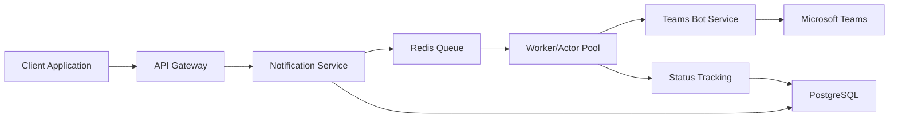

# ⚙️ System Requirement Specification (SRS)

## 1. 文件資訊
- **版本**：v1.0  
- **撰寫人**：System Analyst  
- **最後更新**：2025-10-08  
- **審核人**：Architect, Product Manager

---

## 2. 系統概述
### 2.1 系統目的
建立一個企業級的Teams notification API server，能夠安全、高效地發送訊息到Microsoft Teams的各種目標，並提供完整的監控、計費和運維功能。

### 2.2 系統範圍
- 本系統包含：
  - Teams Bot 通訊模組
  - 通知中台 (Notification Service)
  - Redis Queue 消息佇列
  - PostgreSQL 資料庫
  - 監控和計費系統
- 不包含：
  - 前端 UI 界面
  - Teams 客戶端應用

---

## 3. 功能需求
| 編號 | 模組 | 功能描述 | 輸入 | 輸出 |
|------|------|-----------|------|------|
| FR-001 | 通知API | 接收訊息發送請求 | HTTP Request | JSON Response |
| FR-002 | 目的地驗證 | 驗證notification key和目標 | Notification Key | Validation Result |
| FR-003 | 訊息入隊 | 將訊息推入 Redis Queue | Notification Data | Queue Entry |
| FR-004 | 訊息發送 | 從Queue取出並發送到Teams | Queue Message | Teams Message |
| FR-005 | 狀態追蹤 | 記錄訊息發送狀態 | Message ID | Status Update |
| FR-006 | 重試機制 | 處理發送失敗的重試 | Failed Message | Retry Queue |
| FR-007 | 計費記錄 | 記錄API使用計費 | Usage Data | Billing Record |
| FR-008 | 監控查詢 | 提供歷史查詢和統計 | Query Parameters | Report Data |

---

## 4. 非功能需求 (NFR)
| 編號 | 類別 | 說明 | 指標 |
|------|------|------|------|
| NFR-001 | 效能 | API響應時間 | < 200ms |
| NFR-002 | 效能 | 訊息發送成功率 | ≥ 99.5% |
| NFR-003 | 可用性 | 系統全年可用性 | ≥ 99.9% |
| NFR-004 | 併發性 | 支援併發用戶數 | ≥ 1000 |
| NFR-005 | 安全性 | 所有 API 經過 Token 驗證 | JWT + HTTPS |
| NFR-006 | 安全性 | 訊息內容加密傳輸 | AES-256 |
| NFR-007 | 可維運性 | 系統日誌集中管理 | Log retention 30 天 |
| NFR-008 | 可擴展性 | 支援水平擴展 | 無狀態設計 |

---

## 5. 系統介面
### 5.1 外部介面
- **Teams Bot Framework API**
  - URL: `https://smba.trafficmanager.net/apac/...`
  - Method: POST `/v3/conversations/{id}/activities`
  - 用途：發送訊息到Teams

- **Microsoft Graph API**
  - URL: `https://graph.microsoft.com/v1.0/chats/...`
  - 用途：獲取Teams資訊和發送訊息

- **Redis Queue**
  - 用途：訊息佇列和快取
  - 協議：Redis Protocol

### 5.2 內部介面
- **Notification API**
  - 端點：`POST /internal/v1/notifications`
  - 用途：接收訊息發送請求

- **Status API**
  - 端點：`GET /internal/v1/notifications/status/{id}`
  - 用途：查詢訊息發送狀態

- **Billing API**
  - 端點：`GET /internal/v1/billing/summary`
  - 用途：查詢計費資訊

---

## 6. 架構概觀

### 6.1 核心組件
- **API Gateway**: 處理HTTP請求、認證、限流
- **Notification Service**: 核心業務邏輯
- **Teams Bot Service**: 與Microsoft Teams整合
- **Queue Service**: 處理訊息排隊和重試
- **Cache Service**: Redis快取
- **Database**: PostgreSQL存儲
- **Monitoring**: 健康檢查和指標收集

### 6.2 資料流程
1. API請求 → 認證驗證
2. 權限檢查 → 目標驗證
3. 訊息入隊 → 快取檢查
4. Teams發送 → 狀態更新
5. 結果記錄 → 計費統計

---

## 7. 錯誤與例外處理
### 7.1 錯誤分類
- **認證錯誤** (401): Token無效或過期
- **權限錯誤** (403): 無權限發送到指定目標
- **限流錯誤** (429): 超過發送頻率限制
- **目標錯誤** (404): 目標不存在或無效
- **系統錯誤** (500): 內部系統錯誤

### 7.2 重試策略
- 網路異常：指數退避重試，最多3次
- Teams API限制：延遲重試，最多5次
- 系統錯誤：立即重試，最多2次

### 7.3 降級處理
- Redis Queue滿時：返回HTTP 429
- Teams API不可用：進入重試隊列
- 資料庫連接失敗：使用快取數據

---

## 8. 安全與合規
### 8.1 認證授權
- 使用JWT Token驗證
- 支援API Key認證
- 基於角色的權限控制

### 8.2 資料安全
- 所有通訊使用HTTPS
- 敏感資料加密存儲
- 輸入驗證和XSS防護

### 8.3 審計追蹤
- 所有API調用記錄
- 訊息發送審計日誌
- 操作記錄保存90天

---

## 9. 效能需求
### 9.1 響應時間
- API響應時間 < 200ms
- 訊息發送延遲 < 5秒
- 資料庫查詢 < 100ms

### 9.2 吞吐量
- 支援1000併發用戶
- 每秒處理1000筆通知
- 每日處理10000筆訊息

### 9.3 資源使用
- CPU使用率 < 70%
- 記憶體使用率 < 80%
- 磁碟I/O < 1000 IOPS

---

## 10. 監控與運維
### 10.1 健康檢查
- 端點：`GET /health`
- 檢查項目：資料庫、Redis、Teams API
- 響應時間：< 1秒

### 10.2 監控指標
- 系統指標：CPU、記憶體、磁碟
- 業務指標：發送量、成功率、錯誤率
- 應用指標：響應時間、併發數

### 10.3 告警機制
- 發送失敗率 > 5%
- API響應時間 > 500ms
- 系統可用性 < 99%
- 錯誤率 > 1%

---

## 11. 參考文件
- [Microsoft Bot Framework API Spec](https://learn.microsoft.com/en-us/microsoftteams/platform/bots/)
- [Graph API Documentation](https://learn.microsoft.com/en-us/graph/)
- [Redis Documentation](https://redis.io/documentation)
- [PostgreSQL Documentation](https://www.postgresql.org/docs/)
