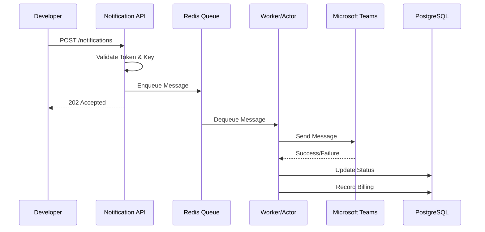
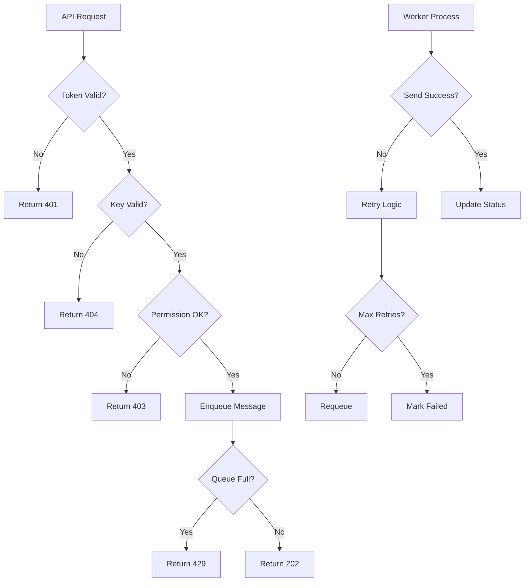

# 👥 Use Case / User Story Document

## 1. 文件資訊
- **版本**：v1.0  
- **撰寫人**：System Analyst  
- **最後更新**：2025-10-08

---

## 2. Use Case Summary
| Use Case ID | 名稱 | 主要角色 | 目標 |
|--------------|------|-----------|------|
| UC-001 | 基本訊息發送 | 開發者 (Developer) | 透過API發送訊息到Teams |
| UC-002 | 目的地申請 | 系統管理員 (Admin) | 申請和審核Teams目的地 |
| UC-003 | 廣播通知 | 業務人員 (Business User) | 發送重要通知到多個群組 |
| UC-004 | 排程發送 | 系統管理員 (Admin) | 設定定期自動通知 |
| UC-005 | 狀態查詢 | 使用者 (User) | 查詢訊息發送狀態 |
| UC-006 | 計費查詢 | 財務人員 (Finance) | 查看API使用計費 |

---

## 3. UC-001：基本訊息發送
### 主角
開發者 (Developer)

### 觸發條件
開發者需要透過API發送訊息到Teams。

### 前置條件
- 已獲得有效的API Token
- 目標Teams目的地已預先註冊
- 擁有對應的notification key

### 主流程
1. 開發者調用通知API
2. 系統驗證API Token和權限
3. 系統檢查notification key和目標
4. 系統將訊息推入Redis Queue
5. Worker從Queue取出訊息
6. 系統透過Teams Bot發送訊息
7. 系統記錄發送狀態和計費資訊

### 例外流程
- API Token無效 → 返回401錯誤
- notification key不存在 → 返回404錯誤
- 目標無權限 → 返回403錯誤
- Redis Queue滿 → 返回429錯誤
- Teams發送失敗 → 進入重試機制

### 後置條件
- 訊息成功發送到Teams
- 發送記錄儲存在資料庫
- 計費資訊已記錄

---

## 4. UC-002：目的地申請
### 主角
系統管理員 (Admin)

### 觸發條件
需要新增Teams目的地用於訊息發送。

### 前置條件
- 管理員已登入系統
- 擁有目的地管理權限

### 主流程
1. 管理員填寫目的地申請表單
2. 提供Teams目標資訊（teamId, channelId, userId等）
3. 設定notification key和權限
4. 系統驗證Teams目標有效性
5. 系統建立目的地記錄
6. 分配唯一的notification key
7. 設定發送配額和頻率限制

### 例外流程
- Teams目標無效 → 返回驗證錯誤
- notification key重複 → 要求重新命名
- 權限不足 → 返回403錯誤

### 成功條件
- 目的地成功註冊
- 獲得有效的notification key
- 可以開始發送訊息

---

## 5. UC-003：廣播通知
### 主角
業務人員 (Business User)

### 觸發條件
需要發送重要通知到多個Teams群組。

### 前置條件
- 已預先註冊多個目的地
- 擁有廣播權限

### 主流程
1. 業務人員準備廣播訊息
2. 選擇多個預註冊的目的地
3. 調用批次發送API
4. 系統驗證所有目標權限
5. 系統將訊息推入多個Queue
6. 多個Worker並行處理
7. 系統追蹤所有發送狀態

### 例外流程
- 部分目標無權限 → 跳過無權限目標
- 部分發送失敗 → 記錄失敗原因
- 系統負載過高 → 延遲發送

### 成功條件
- 至少80%的目標成功發送
- 所有發送狀態已記錄

---

## 6. UC-004：排程發送
### 主角
系統管理員 (Admin)

### 觸發條件
需要設定定期自動通知。

### 前置條件
- 管理員已登入系統
- 擁有排程管理權限

### 主流程
1. 管理員設定排程參數
2. 選擇發送時間和頻率
3. 設定目標目的地
4. 系統建立排程任務
5. 排程器按時觸發發送
6. 系統執行訊息發送流程
7. 記錄排程執行結果

### 例外流程
- 排程時間衝突 → 要求調整時間
- 目標不可用 → 跳過該次發送
- 系統維護期間 → 延遲到維護結束

### 成功條件
- 排程任務成功建立
- 按時自動發送訊息
- 執行結果正確記錄

---

## 7. UC-005：狀態查詢
### 主角
使用者 (User)

### 觸發條件
需要查詢訊息發送狀態。

### 前置條件
- 擁有訊息ID或查詢權限

### 主流程
1. 使用者提供訊息ID
2. 系統查詢發送狀態
3. 返回詳細狀態資訊
4. 包含發送時間、狀態、錯誤訊息等

### 例外流程
- 訊息ID不存在 → 返回404錯誤
- 無查詢權限 → 返回403錯誤
- 系統查詢失敗 → 返回500錯誤

### 成功條件
- 成功返回狀態資訊
- 資訊準確且完整

---

## 8. UC-006：計費查詢
### 主角
財務人員 (Finance)

### 觸發條件
需要查看API使用計費。

### 前置條件
- 擁有計費查詢權限

### 主流程
1. 財務人員設定查詢條件
2. 選擇時間範圍和篩選條件
3. 系統查詢計費資料
4. 生成計費報表
5. 返回詳細計費資訊

### 例外流程
- 查詢時間範圍過大 → 要求縮小範圍
- 無計費資料 → 返回空結果
- 系統查詢超時 → 返回錯誤

### 成功條件
- 成功生成計費報表
- 資料準確且完整

---

## 9. 系統對應圖

---

## 10. 錯誤處理流程

---

## 11. 驗收標準
### 功能驗收
- 所有API端點正常響應
- 訊息成功發送到Teams
- 狀態追蹤準確無誤
- 計費記錄完整

### 效能驗收
- API響應時間 < 200ms
- 訊息發送延遲 < 5秒
- 系統可用性 > 99.9%

### 安全驗收
- 所有API經過認證
- 敏感資料加密傳輸
- 權限控制正確實施
