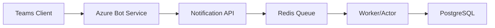

# ⚙️ System Requirement Specification (SRS)

## 1. 文件資訊
- **版本**：v1.0  
- **撰寫人**：System Analyst  
- **最後更新**：2025-10-08  
- **審核人**：Architect, Product Manager

---

## 2. 系統概述
### 2.1 系統目的
說明系統解決的問題與業務價值。

### 2.2 系統範圍
- 本系統包含：
  - Teams Bot 通訊模組
  - 通知中台 (Notification Service)
  - Redis Queue 消息佇列
- 不包含：
  - 前端 UI 界面

---

## 3. 功能需求
| 編號 | 模組 | 功能描述 | 輸入 | 輸出 |
|------|------|-----------|------|------|
| FR-001 | Bot 模組 | 接收 Teams 訊息並回覆 | Teams Message | JSON Response |
| FR-002 | 通知模組 | 將事件推入 Redis Queue | API Request | Queue Entry |
| FR-003 | DB 模組 | 儲存訊息紀錄 | Notification | DB Record |

---

## 4. 非功能需求 (NFR)
| 編號 | 類別 | 說明 | 指標 |
|------|------|------|------|
| NFR-001 | 效能 | 每秒可處理 1000 筆通知 | TPS ≥ 1000 |
| NFR-002 | 可用性 | 系統全年可用性 | ≥ 99.9% |
| NFR-003 | 安全性 | 所有 API 經過 Token 驗證 | JWT + HTTPS |
| NFR-004 | 可維運性 | 系統日誌集中到 ELK | Log retention 30 天 |

---

## 5. 系統介面
### 5.1 外部介面
- **Teams Bot Framework API**
  - URL: `https://smba.trafficmanager.net/apac/...`
  - Method: POST `/v3/conversations/{id}/activities`

- **Graph API**
  - URL: `https://graph.microsoft.com/v1.0/chats/...`

---

## 6. 架構概觀

---

## 7. 錯誤與例外處理
- 當 Redis Queue 滿時，系統應返回 HTTP 429
- 若 Graph API 無權限，回傳錯誤碼 `Authorization_RequestDenied`

---

## 8. 安全與合規
- 使用 Azure Entra ID 作為驗證機制
- 所有存取記錄需留存 90 天

---

## 9. 參考文件
- [Microsoft Bot Framework API Spec](https://learn.microsoft.com/en-us/microsoftteams/platform/bots/)
- [Graph API Documentation](https://learn.microsoft.com/en-us/graph/)
