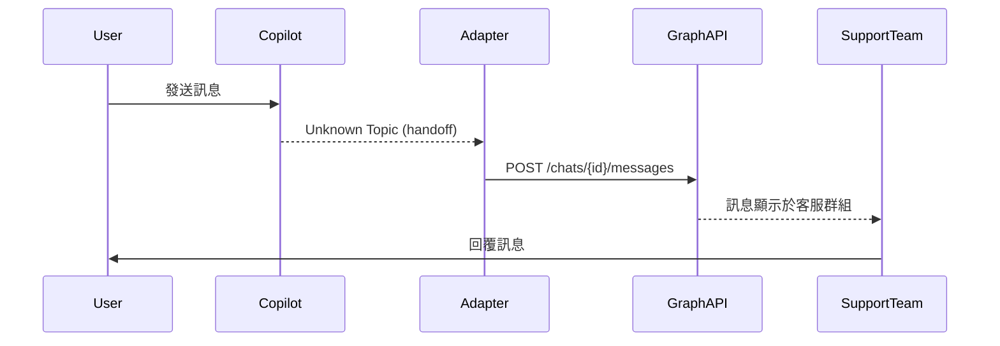

# 👥 Use Case / User Story Document

## 1. 文件資訊
- **版本**：v1.0  
- **撰寫人**：System Analyst  
- **最後更新**：2025-10-08

---

## 2. Use Case Summary
| Use Case ID | 名稱 | 主要角色 | 目標 |
|--------------|------|-----------|------|
| UC-001 | 通知推播 | 使用者 (User) | 接收 Teams 系統通知 |
| UC-002 | 訊息轉客服 | 使用者 / 客服人員 | 將 Copilot 對話轉交真人客服 |

---

## 3. UC-001：通知推播
### 主角
使用者 (Teams User)

### 觸發條件
系統中出現新的事件或警示。

### 主流程
1. 系統接收到業務事件。
2. 通知 API 將訊息推入 Redis Queue。
3. Worker 從 Queue 取出，發送至 Teams。
4. 使用者在 Teams 中收到通知。

### 例外流程
- Redis Queue 已滿 → 返回錯誤。
- Teams 無法連線 → 進入重試機制。

### 後置條件
訊息紀錄儲存在 PostgreSQL。

---

## 4. UC-002：訊息轉客服
### 主角
使用者、客服人員、Copilot Agent

### 前置條件
使用者在 Copilot Chat 內輸入超出自動回覆範圍的問題。

### 主流程
1. Copilot 判斷主題為 “Unknown”。
2. 系統觸發 Generic Handoff。
3. Handoff API 呼叫 Custom Adapter。
4. Adapter 透過 Graph API 將對話轉送客服群組。

### 成功條件
客服群組中顯示該使用者的對話紀錄並可互動。

---

## 5. 系統對應圖

