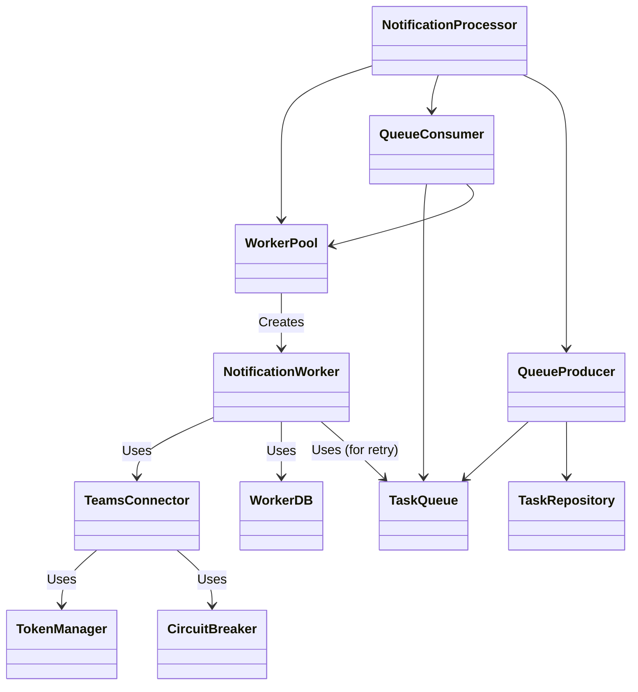

# Notification Actor System Architecture

本文檔描述了 Teams Notification Service 的核心非同步發送架構。該系統採用 **Actor 模式** 與 **優先級佇列 (Priority Queue)** 結合的設計，並嚴格遵循職責分離 (Separation of Concerns) 原則。

## 🏗️ 系統架構全貌 (System Architecture)

系統分為三層：**協調層 (Orchestration)**、**執行層 (Execution)** 與 **基礎設施層 (Infrastructure)**。

```text
========================================================================================
                      NOTIFICATION ACTOR SYSTEM (FULL ARCHITECTURE)
========================================================================================

                                  [ Notification Processor ]
                                  (統一入口，負責啟動所有組件)
                                             |
        +------------------------------------+-------------------------------------+
        |                                    |                                     |
        v                                    v                                     v
[ Queue Producer ] <--(DB Pending)--> [ Queue Consumer ] <--(Redis Queue)--> [ Worker Pool ]
(掃描 DB Pending)                      (監聽 Redis)                          (管理 Worker)
        |                                    |                                     |
        | (推入 Queue)                        | (觸發 Spawn)                        | (分配任務)
        v                                    v                                     v
[ Task Queue ] ---------------------> [ Notification Worker ] <--------------------+
(Priority Lists)                      (任務執行實例 - Per Task)
                                             |
                                             | (1. 執行核心流程)
                                             v
                                  +-----------------------+
                                  |  Teams Connector (NEW)|  <--- [ 執行核心 ]
                                  |   (HTTP 發送執行者)    |
                                  +-----------------------+
                                             |
                    +------------------------+-------------------------+
                    |                        |                         |
                    v                        v                         v
            [ Token Manager ]       [ Circuit Breaker ]       [ HTTP Client ]
            (管理 OAuth Token)      (Redis 熔斷機制)          (實際 POST)
                    |                        |                         |
                    v                        v                         v
            [ Redis Cache ]           [ Redis State ]         [ MS Teams API ]

========================================================================================
```

## 🧩 元件職責詳解 (Component Responsibilities)

### 1. 協調層 (Orchestration Layer)
負責決定「做什麼」、「何時做」，控制任務的生命週期。

| 元件名稱 | Go 檔案 | 職責描述 |
| :--- | :--- | :--- |
| **Notification Worker** | `notification_worker.go` | **任務協調者 (Orchestrator)**<br>• 從 DB 讀取完整任務資料。<br>• 呼叫 `TeamsConnector` 執行發送。<br>• 根據結果 (`Success` / `RetryAfter`) 決定下一步：<br>　- 成功：更新 DB 狀態為 `Sent`。<br>　- 失敗：計算 Backoff 時間，將任務推回 Queue 重試。<br>• **不處理**：HTTP 細節、Token 獲取。 |
| **Worker Pool** | `worker_pool.go` | **資源管理者 (Resource Manager)**<br>• 限制同時運行的 Worker 數量 (Max Concurrency)。<br>• 負責 `New` 出 Worker 實例並注入依賴 (Connector, DB)。 |
| **Queue Consumer** | `queue_consumer.go` | **佇列監聽者 (Listener)**<br>• 持續從 `TaskQueue` (Redis) 獲取任務 ID。<br>• 請求 Pool 生成 Worker 來處理任務。<br>• 若 Pool 滿載，則暫停消費或重新排隊。 |
| **Queue Producer** | `queue_producer.go` | **任務搬運工 (Feeder)**<br>• 定時從 DB 掃描狀態為 `Pending` 的任務。<br>• 依優先級 (`High`, `Normal`, `Low`) 推入 Redis Queue。 |

### 2. 執行層 (Execution Layer)
負責「怎麼做」，處理與外部系統的具體交互。

| 元件名稱 | Go 檔案 | 職責描述 |
| :--- | :--- | :--- |
| **Teams Connector** | `teams_connector.go` | **發送執行者 (Executor)**<br>• **封裝 Teams API**：唯一知道如何組裝 Teams HTTP Payload 的地方。<br>• **Token 管理**：呼叫 `TokenManager` 獲取有效憑證。<br>• **熔斷保護**：發送前檢查 `CircuitBreaker`。<br>• **錯誤處理**：解析 HTTP 429 回傳的 `Retry-After` Header。<br>• **回傳結果**：標準化的 `TeamsSendResult` (含 MessageID 或 Retry 秒數)。 |

### 3. 基礎設施層 (Infrastructure Layer)
提供底層支援工具。

| 元件名稱 | Go 檔案 | 職責描述 |
| :--- | :--- | :--- |
| **Task Queue** | `task_queue.go` | **優先級佇列 (Priority Queue)**<br>• 定義 `Enqueue` / `Dequeue` 介面。<br>• 實作 Redis List (`LPUSH`/`BRPOP`) 操作，支援多個優先級通道。 |
| **Circuit Breaker** | `circuit_breaker.go` | **熔斷機制 (Protection)**<br>• `IsOpen()`: 是否允許請求通過。<br>• `RecordFailure()`: 記錄失敗並在達到閾值時開啟熔斷。<br>• 使用 Redis 共享狀態，保護整個叢集。 |
| **Worker DB** | `actor_db.go` | **資料庫存取 (Persistence)**<br>• 封裝 Repository 操作，提供 Worker 所需的特定查詢方法。 |

## 🔄 核心工作流程 (Workflow)

1.  **任務進場**: API 接收請求 -> 寫入 DB (`Pending`)。
2.  **生產**: `QueueProducer` 掃描 DB -> 推入 `TaskQueue` (Redis)。
3.  **消費**: `QueueConsumer` 監聽 Redis -> 取出任務 ID -> 呼叫 `WorkerPool.SpawnWorker`。
4.  **執行**:
    *   `WorkerPool` 建立 `NotificationWorker` 並注入 `TeamsConnector`。
    *   `NotificationWorker` 準備資料 (`SendPayload`)。
    *   呼叫 `TeamsConnector.Send()`。
5.  **發送 (Connector)**:
    *   檢查熔斷器 -> 拿 Token -> 發送 HTTP POST -> 處理回應。
6.  **結果處理**:
    *   **成功**: Worker 更新 DB (`Sent`)，流程結束。
    *   **失敗 (可重試)**: Worker 計算 Backoff 時間 -> 啟動 Goroutine 等待 -> 時間到後推回 `TaskQueue` (Re-enqueue)。
    *   **失敗 (不可重試)**: Worker 更新 DB (`Failed`)，流程結束。

## 📊 依賴注入關係圖 (Dependency Injection)


