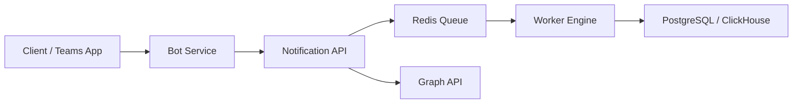

# 🧱 Architecture Overview

## 1. 文件資訊
- **版本**：v1.0  
- **撰寫人**：Software Architect  
- **最後更新**：2025-10-08  

---

## 2. 系統整體架構

描述系統如何組成、分層與溝通方式。

---

## 3. 架構分層
| 層級 | 名稱 | 職責 | 範例組件 |
|------|------|------|-----------|
| L1 | Presentation Layer | 與使用者互動 | Teams Bot, Copilot Agent |
| L2 | Application Layer | 業務邏輯、任務處理 | Notification Service, Queue Dispatcher |
| L3 | Data Layer | 資料儲存、快取 | PostgreSQL, Redis |
| L4 | Integration Layer | 對外 API 整合 | Microsoft Graph API, Azure Services |

---

## 4. 技術棧
| 類別 | 技術 | 用途 |
|------|------|------|
| Backend | Golang (Gin) | RESTful API 與佇列處理 |
| Database | PostgreSQL, Redis | 永久儲存與快取 |
| Queue | Redis Stream | 任務排程與重試機制 |
| Infra | Kubernetes / Azure Container Apps | 部署與監控 |
| Auth | Azure Entra ID | 驗證與授權 |
| Monitor | Grafana / Loki | 監控與日誌收集 |

---

## 5. 架構設計重點
- **高可用性**：支援多實例 Pod，自動 failover。  
- **低耦合性**：模組以 API 通訊，獨立部署。  
- **可觀測性**：每個請求具 trace id，集中式監控。  
- **擴展性**：支援多租戶架構。  

---

## 6. 架構決策紀錄 (ADR)
| 編號 | 決策主題 | 選項比較 | 最終決策 | 原因 |
|------|------------|------------|------------|------|
| ADR-001 | 佇列技術 | Redis vs Kafka | Redis | 較輕量，滿足低延遲需求 |
| ADR-002 | 容器平台 | AKS vs Container Apps | Container Apps | 降低維運負擔 |
| ADR-003 | 資料庫選型 | MongoDB vs PostgreSQL | PostgreSQL | 關聯與查詢需求較強 |

---

## 7. 非功能需求對應
| 類別 | 指標 | 技術實現 |
|------|------|-----------|
| 可用性 | 99.9% SLA | 多區部署 + 健康檢查 |
| 延遲 | <300ms | Redis + Cache Layer |
| 安全性 | Token 驗證 | Entra ID + HTTPS |
| 維運性 | 日誌集中管理 | Loki + Grafana |
