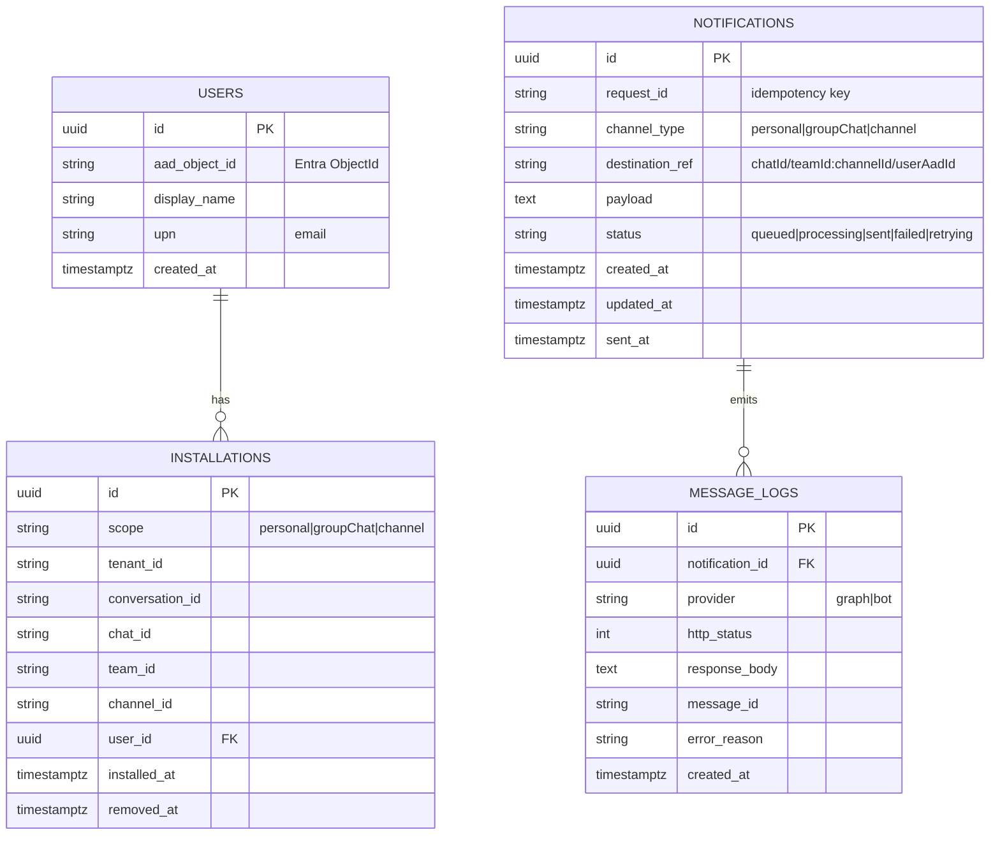

# 🗃️ ERD（資料實體關聯圖）

> 最小資料模型，支援通知任務、發送結果、安裝資訊。

## 索引建議
- `INSTALLATIONS(conversation_id)`、`INSTALLATIONS(chat_id)`
- `NOTIFICATIONS(request_id)`（唯一）
- `MESSAGE_LOGS(notification_id)`

## 參考
- 安裝事件（installationUpdate）會提供 conversation/chat/team/channel 等 id，可寫入 INSTALLATIONS。
- 發送結果記到 MESSAGE_LOGS 供追蹤與稽核。

