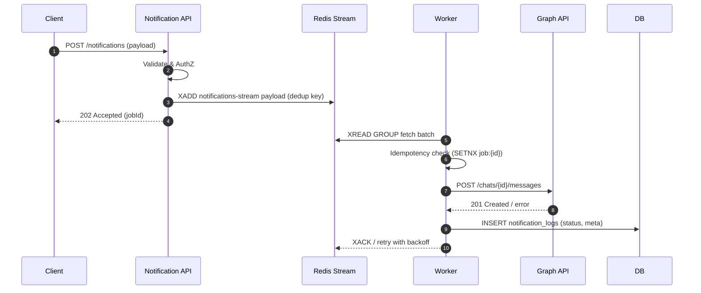
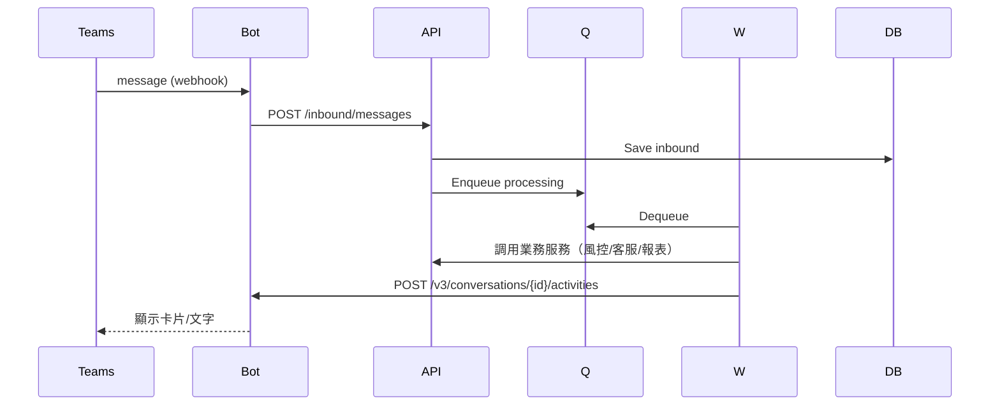

# 💻 System Design

## 1. 文件資訊
- **版本**：v1.0
- **作者**：Tech Lead
- **最後更新**：2025-10-08

---

## 2. 設計目標
- 將需求（PRD、SRS）落地成可實作的技術設計。
- 清楚描述模組邊界、資料流、錯誤處理與擴展點。

---

## 3. 模組劃分與邊界
| 模組 | 職責 | 主要輸入 | 主要輸出 |
|------|------|----------|----------|
| API Gateway / Notification API | 對外 REST 介面、驗證、參數校驗 | HTTP Request | Job Enqueue / DB Record |
| Queue Manager | 將訊息放入佇列，提供重試與去重 | Message DTO | Queue Item |
| Worker / Actor Engine | 從佇列取出並執行發送邏輯 | Queue Item | 成功/失敗結果、紀錄 |
| Integrations (Graph, Bot) | 與外部服務交互 | DTO | HTTP Response |
| Persistence (DB) | 儲存 domain 資料與事件 | Domain Model | Tables / Views |

---

## 4. 主要流程（時序圖）

### 4.1 通知推播（後端主動發送）

### 4.2 使用者訊息 → 後端處理 → 回覆

---

## 5. API 介面（詳細見 OpenAPI）
- 參考：`OpenAPI.yaml`
- 覆蓋：通知建立、查詢、健康檢查、Webhook 入口等

---

## 6. 資料模型（詳細見 ERD）
- 參考：`ERD.md`
- 覆蓋：users、notifications、destinations、message_logs

---

## 7. 錯誤處理與重試
- **分類**：4xx（參數、授權）/ 5xx（暫時性錯誤、外部依賴）
- **重試策略**：指數退避 + 最大次數 + 429/5xx 尊重 Retry-After
- **去重策略**：`SETNX job:{id}` + TTL；寫 DB 前再次核對

---

## 8. 安全性
- Auth：Azure Entra ID（OAuth2/OIDC）/ rbac: roles: admin, operator, viewer
- Transport：HTTPS only；HSTS；TLS1.2+
- Secrets：Key Vault；只在 runtime 注入環境變數
- 日誌遮罩：PII/Token 遮罩

---

## 9. 觀測性（Observability）
- 指標：成功率、P95/P99 latency、佇列長度、重試率、429 比例
- 日誌：結構化 JSON；trace_id, span_id；request_id
- 追蹤：OpenTelemetry（API→Worker→外部）

---

## 10. 設定與開關
| Key | 範例 | 說明 |
|-----|------|------|
| QUEUE_MAX_RETRY | 5 | 最大重試次數 |
| GRAPH_BASE_URL | https://graph.microsoft.com/ | Graph 端點 |
| BOT_SVC_URL | https://smba.trafficmanager.net/... | Bot Framework 端點 |
| RATE_LIMIT_QPS | 50 | 對外呼叫限速 |

---

## 11. 延伸點
- 支援多租戶（TenantId 列、索引、隔離）
- 支援多管道（Email/SMS/LINE/Slack）
- 將 Redis Stream 可切換 Kafka（抽象層 QueueProvider）
