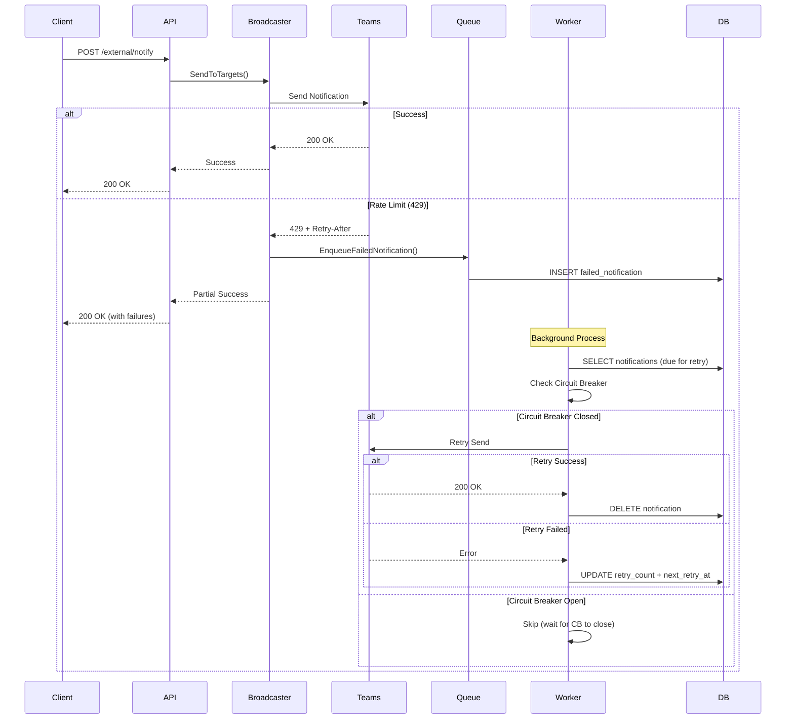

# 通知隊列與熔斷器機制

## 📋 目錄

- [概述](#概述)
- [架構設計](#架構設計)
- [核心組件](#核心組件)
- [工作流程](#工作流程)
- [資料庫設計](#資料庫設計)
- [API 端點](#api-端點)
- [使用範例](#使用範例)
- [配置說明](#配置說明)
- [監控與維護](#監控與維護)

---

## 概述

### 背景

當系統向 Microsoft Teams 發送通知時，可能會遇到以下問題：

1. **速率限制 (Rate Limit)**: Teams API 返回 `429 Too Many Requests` 錯誤
2. **網路問題**: 暫時性的網路故障或超時
3. **服務錯誤**: Teams 服務暫時不可用 (5xx 錯誤)

為了解決這些問題，我們實現了一個**失敗重試隊列**和**熔斷器 (Circuit Breaker)** 機制。

### 目標

- ✅ 自動重試失敗的通知
- ✅ 使用指數退避策略避免過度重試
- ✅ 遵守 Teams API 的 `Retry-After` header
- ✅ 熔斷器保護，防止服務雪崩
- ✅ 持久化失敗記錄，防止數據丟失
- ✅ 提供監控和管理 API

---

## 架構設計

```
┌─────────────────────────────────────────────────────────────┐
│                     Notification Request                     │
└───────────────────────────────┬─────────────────────────────┘
                                │
                                ▼
                    ┌───────────────────────┐
                    │  Broadcast Service    │
                    │  (Send to Teams)      │
                    └───────────┬───────────┘
                                │
                    ┌───────────┴───────────┐
                    │                       │
                ✅ Success            ❌ Failure
                    │                       │
                    │                       ▼
                    │           ┌───────────────────────┐
                    │           │  Enqueue Failed       │
                    │           │  Notification         │
                    │           └───────────┬───────────┘
                    │                       │
                    │                       ▼
                    │           ┌───────────────────────┐
                    │           │  notification_destinations (status/retry_count/next_retry_at/failure_reason) │
                    │           │  (Database Table)     │
                    │           └───────────┬───────────┘
                    │                       │
                    │                       ▼
                    │           ┌───────────────────────┐
                    │           │  Queue Worker         │
                    │           │  (Background Process) │
                    │           └───────────┬───────────┘
                    │                       │
                    │           ┌───────────┴───────────┐
                    │           │                       │
                    │           ▼                       ▼
                    │   ┌───────────────┐   ┌──────────────────┐
                    │   │ Circuit       │   │ Retry Policy     │
                    │   │ Breaker       │   │ (Exponential     │
                    │   │ Check         │   │  Backoff)        │
                    │   └───────┬───────┘   └────────┬─────────┘
                    │           │                    │
                    │           ▼                    ▼
                    │   ┌─────────────────────────────────┐
                    │   │     Retry Send to Teams        │
                    │   └─────────────┬───────────────────┘
                    │                 │
                    └─────────────────┴──► Success: Remove from Queue
                                      │
                                      └──► Failure: Update Retry Count
```

---

## 核心組件

### 1. Circuit Breaker (熔斷器)

**文件**: `internal/queue/circuit_breaker.go`

#### 三種狀態

```
┌─────────┐  Max Failures   ┌─────────┐  Timeout     ┌──────────┐
│ Closed  │ ───────────────►│  Open   │ ──────────►  │ Half-Open │
│(正常)   │                 │(熔斷)   │              │(測試)     │
└────▲────┘                 └─────────┘              └─────┬─────┘
     │                                                      │
     └──────────────── Success Requests ───────────────────┘
```

1. **Closed (關閉狀態)**: 正常運作，允許所有請求
   - 當失敗次數達到閾值 → 切換到 **Open**

2. **Open (開啟狀態)**: 熔斷狀態，拒絕所有請求
   - 避免持續向不可用的服務發送請求
   - 等待一段時間後 → 切換到 **Half-Open**

3. **Half-Open (半開狀態)**: 測試狀態，允許少量請求測試服務恢復
   - 如果測試請求成功 → 切換回 **Closed**
   - 如果測試請求失敗 → 切換回 **Open**

#### 配置參數

```go
type CircuitBreaker struct {
    maxFailures     uint32        // 觸發熔斷的失敗次數閾值 (預設: 5)
    timeout         time.Duration // 熔斷後等待時間 (預設: 1 分鐘)
    halfOpenMaxReqs uint32        // 半開狀態允許的測試請求數 (預設: 3)
}
```

#### 使用方式

```go
// 執行受保護的操作
err := circuitBreaker.Execute(ctx, func() error {
    return sendToTeams(message)
})

if err == ErrCircuitOpen {
    // 熔斷器開啟，服務不可用
    log.Println("Circuit breaker is open, service unavailable")
}
```

---

### 2. Retry Policy (重試策略)

**文件**: `internal/queue/retry_policy.go`

#### 指數退避 (Exponential Backoff) + 隨機抖動 (Jitter)

重試時間計算公式：

```
backoff = initialBackoff × (multiplier ^ retryCount)
backoff = min(backoff, maxBackoff)
backoff += random(-jitter, +jitter)
```

#### 預設配置

```go
DefaultRetryPolicy() *RetryPolicy {
    return &RetryPolicy{
        MaxRetries:     5,                    // 最多重試 5 次
        InitialBackoff: 1 * time.Second,      // 初始等待 1 秒
        MaxBackoff:     5 * time.Minute,      // 最長等待 5 分鐘
        Multiplier:     2.0,                  // 每次翻倍
        JitterFraction: 0.1,                  // 10% 隨機抖動
    }
}
```

#### 重試時間範例

| 重試次數 | 基礎退避時間 | 實際範圍 (±10% jitter) |
|---------|------------|---------------------|
| 1       | 1 秒       | 0.9s - 1.1s         |
| 2       | 2 秒       | 1.8s - 2.2s         |
| 3       | 4 秒       | 3.6s - 4.4s         |
| 4       | 8 秒       | 7.2s - 8.8s         |
| 5       | 16 秒      | 14.4s - 17.6s       |

#### 處理 Retry-After Header

Teams API 在返回 429 錯誤時會包含 `Retry-After` header，指示何時可以重試：

```go
func RateLimitBackoff(retryAfterHeader string, defaultBackoff time.Duration) time.Duration {
    if retryAfter := GetRetryAfterDuration(retryAfterHeader); retryAfter > 0 {
        return retryAfter + (1 * time.Second) // 額外加 1 秒緩衝
    }
    return defaultBackoff
}
```

---

### 3. Failed Notification Queue (失敗通知隊列)

**文件**: `internal/queue/failed_notification.go`

#### 失敗原因分類

```go
type FailureReason string

const (
    FailureReasonRateLimit    = "rate_limit"    // 429 - 超出速率限制
    FailureReasonTimeout      = "timeout"       // 408 - 請求超時
    FailureReasonUnauthorized = "unauthorized"  // 401/403 - 未授權
    FailureReasonServerError  = "server_error"  // 5xx - 伺服器錯誤
    FailureReasonNetworkError = "network_error" // 網路問題
    FailureReasonUnknown      = "unknown"       // 其他錯誤
)
```

#### 可重試錯誤判斷

```go
func IsRetryableError(statusCode int) bool {
    return statusCode == 429 ||  // Rate Limit
           statusCode == 408 ||  // Timeout
           (statusCode >= 500 && statusCode < 600) // Server Errors
}
```

---

### 4. Queue Manager (隊列管理器)

**文件**: `internal/queue/manager.go`

#### 核心職責

1. **Worker Pool**: 並發處理失敗通知
2. **Circuit Breaker Integration**: 整合熔斷器保護
3. **Retry Scheduling**: 根據重試策略調度重試
4. **Cleanup**: 定期清理過期記錄

#### 配置參數

```go
type Config struct {
    WorkerPool    int           // 並發工作數 (預設: 3)
    PollInterval  time.Duration // 輪詢間隔 (預設: 10 秒)
    BatchSize     int           // 每次處理批次 (預設: 10)
    CleanupPeriod time.Duration // 清理週期 (預設: 24 小時)
    MaxFailures   uint32        // CB 失敗閾值 (預設: 5)
    CBTimeout     time.Duration // CB 超時時間 (預設: 1 分鐘)
}
```

#### 工作流程

```go
// 1. 啟動 Queue Manager
queueManager.Start()

// 2. Worker 定期輪詢
for {
    // 檢查 Circuit Breaker 狀態
    if circuitBreaker.IsOpen() {
        continue // 跳過這輪處理
    }
    
    // 從資料庫取出待重試的通知
    notifications := repo.Dequeue(batchSize)
    
    // 逐一重試
    for _, fn := range notifications {
        err := circuitBreaker.Execute(func() {
            return sender.SendToTarget(fn.TargetID, fn.Message)
        })
        
        if err == nil {
            // 成功：從隊列移除
            repo.Delete(fn.ID)
        } else {
            // 失敗：更新重試次數和下次重試時間
            nextRetry := calculateBackoff(fn.RetryCount + 1)
            repo.UpdateRetry(fn.ID, false, err.Error(), nextRetry)
        }
    }
}
```

---

## 工作流程

### 完整流程圖



### 步驟說明

#### 1. 通知發送失敗

```go
// Broadcast Service 檢測到錯誤
if err := sendToTeams(target, message); err != nil {
    if IsRetryableError(statusCode) {
        // 將失敗通知加入隊列
        failedNotification := &FailedNotification{
            NotificationID: notifID,
            TargetID:       target.ID,
            Message:        message,
            Reason:         ClassifyFailureReason(statusCode),
            ErrorMessage:   err.Error(),
            RetryCount:     0,
            MaxRetries:     5,
            NextRetryAt:    time.Now().Add(1 * time.Second),
        }
        queueManager.EnqueueFailedNotification(ctx, failedNotification)
    }
}
```

#### 2. Worker 輪詢處理

```go
// Worker 定期檢查隊列 (每 10 秒)
ticker := time.NewTicker(10 * time.Second)
for range ticker.C {
    // 檢查 Circuit Breaker
    if circuitBreaker.GetState() == StateOpen {
        log.Println("Circuit breaker open, skipping")
        continue
    }
    
    // 取出待重試通知
    notifications, _ := repo.Dequeue(ctx, 10)
    
    for _, fn := range notifications {
        retryNotification(ctx, fn)
    }
}
```

#### 3. 重試執行

```go
func retryNotification(ctx context.Context, fn *FailedNotification) {
    // 使用 Circuit Breaker 保護
    err := circuitBreaker.Execute(ctx, func() error {
        return sender.SendToTarget(ctx, fn.TargetID, fn.Message, fn.Metadata)
    })
    
    if err == nil {
        // 成功：從隊列移除
        repo.Delete(ctx, fn.ID)
        log.Printf("Notification %s retry succeeded", fn.ID)
    } else {
        // 失敗：計算下次重試時間
        if retryPolicy.ShouldRetry(fn.RetryCount + 1) {
            backoff := retryPolicy.CalculateBackoff(fn.RetryCount + 1)
            nextRetry := time.Now().Add(backoff)
            repo.UpdateRetry(ctx, fn.ID, false, err.Error(), nextRetry)
        } else {
            // 達到最大重試次數
            repo.MarkExhausted(ctx, fn.ID)
        }
    }
}
```

---

## 資料庫設計

### Failed Notifications 表結構

**Migration 文件**: `scripts/migrations/009_enhance_notification_destinations_for_async_actor.sql`

```sql
CREATE TABLE failed_notifications (
    id UUID PRIMARY KEY DEFAULT gen_random_uuid(),
    notification_id UUID NOT NULL REFERENCES notifications(id),
    project_id UUID NOT NULL REFERENCES projects(id),
    target_id VARCHAR(500) NOT NULL,
    message TEXT NOT NULL,
    reason VARCHAR(50) NOT NULL,
    error_message TEXT,
    retry_count INTEGER NOT NULL DEFAULT 0,
    max_retries INTEGER NOT NULL DEFAULT 5,
    next_retry_at TIMESTAMP WITH TIME ZONE NOT NULL,
    retry_after INTEGER,
    created_at TIMESTAMP WITH TIME ZONE NOT NULL DEFAULT NOW(),
    updated_at TIMESTAMP WITH TIME ZONE NOT NULL DEFAULT NOW(),
    last_attempt_at TIMESTAMP WITH TIME ZONE,
    installation_id UUID REFERENCES bot_installations(id),
    bot_id UUID REFERENCES teams_bots(id),
    metadata JSONB DEFAULT '{}'::jsonb,
    
    CONSTRAINT check_retry_count CHECK (retry_count <= max_retries)
);
```

### 索引設計

```sql
-- 高效查詢待重試通知
CREATE INDEX idx_failed_notifications_next_retry 
    ON failed_notifications(next_retry_at) 
    WHERE retry_count < max_retries;

-- 按通知 ID 查詢
CREATE INDEX idx_failed_notifications_notification_id 
    ON failed_notifications(notification_id);

-- 按專案查詢
CREATE INDEX idx_failed_notifications_project_id 
    ON failed_notifications(project_id);

-- 按失敗原因統計
CREATE INDEX idx_failed_notifications_reason 
    ON failed_notifications(reason);
```

### 監控視圖

```sql
CREATE VIEW failed_notifications_queue_status AS
SELECT 
    COUNT(*) FILTER (WHERE retry_count < max_retries AND next_retry_at > NOW()) 
        as pending_count,
    COUNT(*) FILTER (WHERE retry_count < max_retries AND next_retry_at <= NOW()) 
        as ready_for_retry_count,
    COUNT(*) FILTER (WHERE retry_count >= max_retries) 
        as exhausted_count,
    MIN(next_retry_at) FILTER (WHERE retry_count < max_retries) 
        as next_retry_due,
    MIN(created_at) FILTER (WHERE retry_count < max_retries) 
        as oldest_pending,
    MAX(updated_at) as last_activity
FROM failed_notifications;
```

---

## API 端點

### 1. 查詢隊列狀態

```bash
GET /api/v1/queue/status
```

**回應範例**:
```json
{
  "total_pending": 15,
  "total_retrying": 3,
  "total_failed": 2,
  "next_retry_due": "2025-10-01T10:30:00Z",
  "oldest_pending": "2025-10-01T10:00:00Z",
  "circuit_state": "closed",
  "last_updated": "2025-10-01T10:25:30Z"
}
```

### 2. 查詢熔斷器指標

```bash
GET /api/v1/queue/circuit-breaker/metrics
```

**回應範例**:
```json
{
  "state": "closed",
  "total_requests": 1523,
  "success_requests": 1498,
  "failed_requests": 25,
  "failures": 0,
  "last_state_change": "2025-10-01T09:00:00Z"
}
```

### 3. 重置熔斷器

```bash
POST /api/v1/queue/circuit-breaker/reset
```

**使用場景**: 當確認 Teams 服務已恢復，手動重置熔斷器

**回應範例**:
```json
{
  "message": "Circuit breaker reset successfully"
}
```

---

## 使用範例

### 測試腳本

**文件**: `scripts/test_queue.sh`

```bash
#!/bin/bash

# 1. 檢查隊列狀態
curl -X GET http://localhost:8080/api/v1/queue/status | jq '.'

# 2. 查看熔斷器指標
curl -X GET http://localhost:8080/api/v1/queue/circuit-breaker/metrics | jq '.'

# 3. 監控隊列變化
watch -n 2 'curl -s http://localhost:8080/api/v1/queue/status | jq "."'

# 4. 重置熔斷器（如需要）
curl -X POST http://localhost:8080/api/v1/queue/circuit-breaker/reset
```

執行測試：
```bash
chmod +x scripts/test_queue.sh
./scripts/test_queue.sh
```

---

## 配置說明

### 環境變數

在 `cmd/server/main.go` 中初始化：

```go
// Queue 配置
queueConfig := &queue.Config{
    WorkerPool:    3,                    // 3 個並發 worker
    PollInterval:  10 * time.Second,     // 每 10 秒輪詢一次
    BatchSize:     10,                   // 每次處理 10 個通知
    CleanupPeriod: 24 * time.Hour,       // 每天清理一次
    MaxFailures:   5,                    // 5 次失敗後熔斷
    CBTimeout:     1 * time.Minute,      // 熔斷 1 分鐘後測試恢復
}
```

### 調整建議

#### 高流量場景
```go
WorkerPool:   10,              // 增加 worker 數量
BatchSize:    50,              // 增加批次大小
PollInterval: 5 * time.Second, // 更頻繁輪詢
```

#### 低流量場景
```go
WorkerPool:   1,                // 減少 worker
BatchSize:    5,                // 減少批次
PollInterval: 30 * time.Second, // 降低輪詢頻率
```

---

## 監控與維護

### 監控指標

1. **隊列積壓**
   - `total_pending`: 待處理數量
   - `total_retrying`: 重試中數量
   - 告警閾值: > 100

2. **熔斷器狀態**
   - `circuit_state`: closed/open/half-open
   - 告警: state = "open" 超過 5 分鐘

3. **失敗率**
   - `failed_requests / total_requests`
   - 告警閾值: > 5%

### 維護操作

#### 1. 查看隊列積壓

```sql
SELECT 
    reason,
    COUNT(*) as count,
    AVG(retry_count) as avg_retries
FROM notification_destinations
WHERE retry_count < max_retries
GROUP BY reason;
```

#### 2. 清理過期記錄

```sql
-- 手動清理 7 天前已耗盡的通知
UPDATE notification_destinations SET status='failed'
WHERE retry_count >= max_retries
  AND updated_at < NOW() - INTERVAL '7 days';
```

#### 3. 重試指定通知

```sql
-- 重置特定通知的重試次數
UPDATE notification_destinations
SET retry_count = 0,
    next_retry_at = NOW()
WHERE notification_id = 'xxx-xxx-xxx';
```

### 日誌監控

關鍵日誌：
```
Queue manager started successfully           // 啟動成功
Worker X started                             // Worker 啟動
Worker X: Processing N notifications         // 處理通知
Notification X retry succeeded               // 重試成功
Notification X retry failed: error message   // 重試失敗
Circuit breaker is open, skipping            // 熔斷器開啟
```

---

## 故障排查

### 問題：隊列積壓過多

**可能原因**:
1. Teams API 持續返回錯誤
2. Worker 數量不足
3. Circuit Breaker 長期開啟

**解決方法**:
```bash
# 1. 檢查熔斷器狀態
curl http://localhost:8080/api/v1/queue/circuit-breaker/metrics

# 2. 如果 CB 開啟，確認 Teams 服務正常後重置
curl -X POST http://localhost:8080/api/v1/queue/circuit-breaker/reset

# 3. 增加 worker 數量（需重啟服務）
# 修改 queueConfig.WorkerPool = 10
```

### 問題：通知重複發送

**可能原因**:
- 隊列處理邏輯問題
- 資料庫事務未正確提交

**檢查**:
```sql
-- 查看是否有重複處理
SELECT target_id, message, COUNT(*)
FROM notification_destinations
GROUP BY target_id, message
HAVING COUNT(*) > 1;
```

---

## 最佳實踐

### 1. 合理設置重試次數

```go
// 根據業務重要性調整
CriticalNotification.MaxRetries = 10  // 重要通知多重試
NormalNotification.MaxRetries = 5     // 一般通知
LowPriorityNotification.MaxRetries = 3 // 低優先級少重試
```

### 2. 監控告警設置

- 隊列積壓 > 100 → 警告
- 隊列積壓 > 500 → 嚴重警告
- Circuit Breaker 開啟 > 5 分鐘 → 告警
- 失敗率 > 10% → 告警

### 3. 定期清理

```go
// 自動清理 7 天前的記錄
CleanupPeriod: 24 * time.Hour  // 每天執行
OlderThan: 7 * 24 * time.Hour  // 刪除 7 天前
```

---

## 參考資料

- [Microsoft Teams Bot Rate Limits](https://learn.microsoft.com/en-us/microsoftteams/platform/bots/how-to/rate-limit)
- [Circuit Breaker Pattern](https://martinfowler.com/bliki/CircuitBreaker.html)
- [Exponential Backoff and Jitter](https://aws.amazon.com/blogs/architecture/exponential-backoff-and-jitter/)

---

## 版本歷史

- **v1.0.0** (2025-10-01)
  - 初始版本
  - 實現基礎隊列和熔斷器機制
  - 支援指數退避重試
  - 提供監控 API

---

**作者**: TeamsNotify Team  
**最後更新**: 2025-10-01

