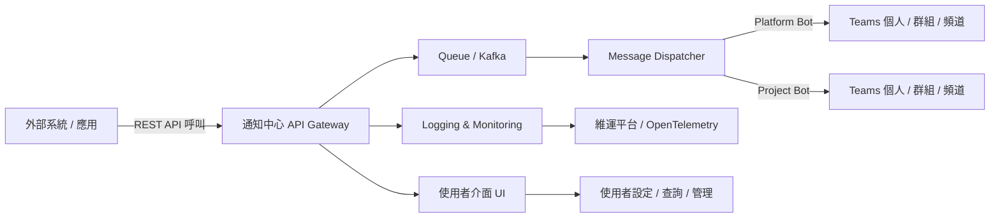

# Teams 訊息通知中心系統介紹與使用說明書

## 1. 文件目的
本文件定義「Teams 訊息通知中心系統」的介紹與使用說明書，提供一般使用者、系統整合者及維運人員參考。  

系統同時提供 **使用者介面 (UI)** 與 **API 入口**，能集中接收多個應用或服務的訊息，並依照規則將訊息轉發至 Microsoft Teams 的 **群組聊天 (Group Chat)**、**頻道 (Channel)**、或 **個人對話 (User)**。

---

## 2. 系統架構概觀  

### 2.1 架構圖

---

## 3. 功能介紹  

1. **訊息轉發**  
   - 可將外部系統的訊息傳送到 Teams 的群組、頻道或個人。  
   - 支援單筆與批次訊息。  
   - 支援純文字與簡單 Markdown 格式。  

2. **訊息傳送模式**  
   - **Platform Bot 模式**  
     - 需要目標 Email 或 Conversation ID（User / Group / Channel）。  
     - 訊息以非同步方式傳送，具備速率限制與目標數量限制。  
   - **Project Bot 模式**（第三方 Bot）  
     - 透過上架的 Bot 廣播訊息給所有安裝者。  
     - 提供 Queue 機制，確保訊息在合理時間內送達。  
     - 可限制僅特定群組能安裝。  
     - 提供安裝清單（使用者、群組、頻道，非即時）。  
     - 支援指定安裝者或群組作為目標。  

3. **廣播功能**  
   - 使用 Project Bot 可進行大規模廣播。  
   - 系統具備 Queue 機制，避免訊息暴衝或遺漏。  

4. **存取控制**  
   - 支援限制僅特定群組能安裝指定 Bot。  
   - 管理者可查詢安裝清單。  

5. **監控與稽核**  
   - 提供訊息日誌查詢（訊息 ID、時間、目標、狀態）。  
   - 支援 OpenTelemetry Trace，可串接 APM 工具。  
   - 提供錯誤率、延遲、成功率等監控指標。  

6. **使用者介面 (UI)**  
   - Web 介面功能包含：  
     - 查詢訊息發送紀錄  
     - 管理目標清單  
     - 測試 API 發送  
     - 檢視廣播任務進度與錯誤報告  

---

## 4. 使用者操作指南  

### Platform Bot 操作流程
1. **安裝 Bot**  
   - 在 Teams 內搜尋並安裝指定的 Bot。  
   - 確認 Bot 已出現在群組 / 頻道內。  

2. **申請權限**  
   - 向系統管理員申請使用權限，會配發 `notify_key`。  
   - 取得目標的 Conversation ID 或 Email。  
   - 向 CaaS 申請 API 的 Key 與 Secret。  

3. **發送訊息測試**  
   - 呼叫 CaaS API Endpoint。  
   - 使用 `API Key + Secret + notify_key` 發送訊息。  
   - 在 Teams 中確認訊息是否送達。  

4. **監控與除錯**  
   - 若訊息延遲或失敗，可透過 API 查詢狀態。  
   - 廣播任務則可檢視 Queue 狀態。  

### Project Bot 操作流程
1. **申請 Bot 上架**  
   - 透過表單提出申請，將 Project Bot 上架到 Teams。  
   - 確認 Bot 已出現在 Teams App 中。  

2. **安裝 Bot**  
   - 在 Teams 內搜尋並安裝 Project Bot。  
   - 確認 Bot 已出現在群組 / 頻道內。  

3. **申請權限**  
   - 向系統管理員申請使用權限，會配發 `notify_key`。  
   - 取得目標的 Conversation ID 或 Email。  
   - 向 CaaS 申請 API 的 Key 與 Secret。  

4. **發送訊息測試**  
   - 在 UI 介面中可看到 Project Bot。  
   - 呼叫 CaaS API Endpoint，並使用 `API Key + Secret + notify_key` 發送訊息。  
   - 在 Teams 中確認訊息是否送達。  

5. **監控與除錯**  
   - 若訊息延遲或失敗，可透過 API 查詢狀態。  
   - 廣播任務則可檢視 Queue 狀態。  

---

## 7. 常見問題 (FAQ)

1. **是否可以傳送檔案或圖片？**  
   - 目前僅支援文字與 Markdown，檔案與圖片需另行開發。  

2. **若訊息發送失敗，是否會自動重試？**  
   - 是，系統內建最多三次的自動重試，若仍失敗則會寫入錯誤日誌。  

3. **是否支援跨租戶傳送？**  
   - 不支援，Bot 僅能在同租戶內使用。  
