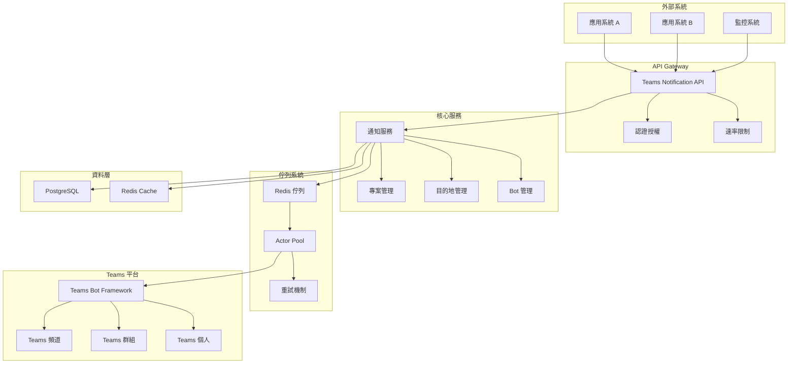

# 🧱 Architecture Overview

## 1. 文件資訊

- **版本**：v1.1
- **撰寫人**：Software Architect
- **最後更新**：2025-10-11
- **審核人**：System Analyst, Tech Lead

---

## 2. 系統整體架構

Teams Notification API 是一個基於 Go 的微服務架構，提供企業級的 Teams 通知服務。系統採用 Actor 模式處理異步通知，使用 Redis 作為隊列和快取層，PostgreSQL 作為持久化存儲。



---

## 3. 架構分層


| 層級 | 名稱               | 職責               | 範例組件                                 |
| ---- | ------------------ | ------------------ | ---------------------------------------- |
| L1   | Presentation Layer | 與使用者互動       | Teams Bot, API Gateway                   |
| L2   | Application Layer  | 業務邏輯、任務處理 | Notification Service, Actor Pool         |
| L3   | Data Layer         | 資料儲存、快取     | PostgreSQL, Redis                        |
| L4   | Integration Layer  | 對外 API 整合      | Microsoft Graph API, Teams Bot Framework, Azure Entra ID |

---

## 4. 技術棧


| 類別     | 技術                | 用途                   |
| -------- | ------------------- | ---------------------- |
| Backend  | Golang (Gin)        | RESTful API 與佇列處理 |
| Database | PostgreSQL, Redis   | 永久儲存與快取         |
| Queue    | Redis List + SETNX  | 任務排程與重試機制     |
| Infra    | Docker + Kubernetes | 部署與監控             |
| Auth     | Azure Entra ID      | 驗證與授權             |
| Monitor  | 內建健康檢查        | 監控與日誌收集         |

---

## 5. 核心組件

### 5.1 API 服務器 (`cmd/server`)

- **框架**: Gin (HTTP 路由器)
- **功能**: 提供 RESTful API 端點
- **認證**: JWT + API Key 雙重認證
- **中間件**: 日誌、錯誤處理、速率限制

### 5.2 業務邏輯層 (`internal/api/services`)

- **NotificationService**: 通知管理邏輯
- **ProjectService**: 專案管理
- **DestinationService**: 目的地管理
- **BroadcastService**: 廣播服務
- **ProvisionService**: 一鍵建立服務

### 5.3 Actor 系統 (`internal/actor`)

- **NotificationActor**: 單一通知處理 Actor
- **ActorPool**: Actor 池管理
- **Redis 整合**: 使用 Redis 管理佇列和狀態
- **重試機制**: 指數退避 + Teams Retry-After

### 5.4 資料存取層 (`internal/api/repositories`)

- **Repository 模式**: 統一的資料存取介面
- **支援**: PostgreSQL + Redis
- **事務**: 支援資料庫事務

---

## 6. 資料流程

### 6.1 通知發送流程

```
1. 外部系統 → API 端點
2. API 驗證 → 數據庫存儲
3. 隊列入隊 → Redis 隊列
4. Actor Pool → 處理通知
5. Teams API → 發送消息
6. 狀態更新 → 數據庫記錄
```

### 6.2 Two-loop Enqueue Design

```
Producer Loop (API write only):
- 接收請求 → 寫入 notification_destinations (status=pending)
- 不進行 Redis 操作，降低延遲

EnqueueWorker (background):
- 定期掃描 pending 狀態的 notification_destinations
- 按優先級推入 Redis 隊列 (high/normal/low)
- 更新狀態為 enqueued

Consumer Side:
- QueueConsumer 執行 BLPOP 操作
- ActorPool 管理 Actor 並發
- 使用 SETNX 確保唯一處理
```

---

## 7. 架構設計重點

- **高可用性**: 支援多實例 Pod，自動 failover
- **低耦合性**: 模組以 API 通訊，獨立部署
- **可觀測性**: 每個請求具 trace id，集中式監控
- **擴展性**: 支援多租戶架構
- **可靠性**: 電路斷路器、重試機制、錯誤處理

---

## 8. 架構決策紀錄 (ADR)


| 編號    | 決策主題   | 選項比較              | 最終決策        | 原因                   |
| ------- | ---------- | --------------------- | --------------- | ---------------------- |
| ADR-001 | 佇列技術   | Redis vs Kafka        | Redis           | 較輕量，滿足低延遲需求 |
| ADR-002 | 容器平台   | AKS vs Container Apps | Docker + K8s    | 降低維運負擔           |
| ADR-003 | 資料庫選型 | MongoDB vs PostgreSQL | PostgreSQL      | 關聯與查詢需求較強     |
| ADR-004 | Actor 模式 | 自建 vs 第三方        | 自建 Actor Pool | 更靈活的控制和調優     |
| ADR-005 | 快取策略   | 內存 vs Redis         | Redis           | 支援多實例共享         |

---

## 9. 非功能需求對應


| 類別   | 指標            | 技術實現              |
| ------ | --------------- | --------------------- |
| 可用性 | 99.9% SLA       | 多區部署 + 健康檢查   |
| 延遲   | <200ms API 響應 | Redis + Cache Layer   |
| 安全性 | Token 驗證      | Entra ID + HTTPS      |
| 維運性 | 日誌集中管理    | 結構化日誌 + 健康檢查 |
| 擴展性 | 水平擴展        | 無狀態設計 + 負載均衡 |

---

## 10. 安全架構

### 10.1 認證機制

- **JWT Token**: 用戶認證
- **API Key**: 服務認證
- **OAuth2**: Teams API 認證

### 10.2 安全措施

- **HTTPS**: 傳輸加密
- **輸入驗證**: 防止注入攻擊
- **速率限制**: 防止濫用
- **審計日誌**: 操作追蹤

---

## 11. 性能架構

### 11.1 緩存策略

- **Token 快取**: Redis 存儲，50 分鐘 TTL
- **配置快取**: 內存存儲，啟動時載入
- **數據快取**: 查詢結果快取

### 11.2 並發處理

- **Goroutine 池**: 控制並發數量
- **Actor Pool**: 異步任務處理
- **連接池**: 數據庫和 Redis 連接池

### 11.3 負載均衡

- **水平擴展**: 多實例部署
- **負載分散**: 請求分發
- **故障轉移**: 自動故障切換

---

## 12. 監控架構

### 12.1 系統監控

#### 12.1.1 指標收集

- **系統指標**: CPU、內存、磁盤使用率
- **應用指標**: 請求數、響應時間、錯誤率
- **業務指標**: 通知發送量、成功率、佇列長度
- **數據庫指標**: 連接數、查詢時間、慢查詢
- **Redis 指標**: 內存使用、鍵數量、命中率

#### 12.1.2 監控端點

| 端點 | 用途 | 認證 | 響應時間 |
|------|------|------|----------|
| `/health` | 基本健康檢查 | 無 | < 200ms |
| `/api/v1/metrics` | 系統指標 | 無 | < 500ms |
| `/api/v1/config` | 配置信息 | 無 | < 200ms |
| `/api/v1/config/validate` | 配置驗證 | 無 | < 300ms |
| `/internal/v1/queue/stats` | 佇列統計 | 無 | < 200ms |

#### 12.1.3 監控系統端點

| 端點 | 用途 | 認證 | 響應時間 |
|------|------|------|----------|
| `/internal/v1/monitoring/health` | 系統健康檢查 | 無 | < 200ms |
| `/internal/v1/monitoring/performance` | 性能指標 | 無 | < 500ms |
| `/internal/v1/monitoring/business` | 業務指標 | 無 | < 300ms |
| `/internal/v1/monitoring/alerts` | 警報狀態 | 無 | < 200ms |
| `/internal/v1/monitoring/dashboard` | 監控儀表板 | 無 | < 500ms |

### 12.2 告警機制

#### 12.2.1 告警規則

- **系統告警**: CPU > 80%, 內存 > 90%, 磁盤 > 85%
- **應用告警**: 錯誤率 > 5%, 響應時間 > 2s
- **業務告警**: 通知失敗率 > 10%, 佇列積壓 > 1000
- **數據庫告警**: 連接數 > 80%, 慢查詢 > 10%

#### 12.2.2 告警端點

| 端點 | 用途 | 認證 | 說明 |
|------|------|------|------|
| `/api/v1/alerts` | 當前告警 | 無 | 返回活躍告警列表 |
| `/api/v1/alerts/history` | 告警歷史 | 無 | 返回告警歷史記錄 |
| `/api/v1/alerts/check` | 手動檢查 | 無 | 手動觸發告警檢查 |
| `/internal/v1/monitoring/alerts` | 監控警報 | 無 | 返回監控系統警報狀態 |

### 12.3 日誌管理

#### 12.3.1 日誌結構

- **格式**: JSON 結構化日誌
- **級別**: Debug、Info、Warn、Error、Fatal
- **字段**: timestamp, level, message, service, trace_id, user_id

#### 12.3.2 日誌分類

- **訪問日誌**: HTTP 請求/響應
- **應用日誌**: 業務邏輯和錯誤
- **系統日誌**: 系統事件和狀態
- **審計日誌**: 安全相關操作

### 12.4 健康檢查

#### 12.4.1 檢查項目

- **數據庫連接**: PostgreSQL 連接狀態
- **Redis 連接**: Redis 連接狀態
- **Teams API**: Microsoft Teams API 可用性
- **依賴服務**: 外部服務健康狀態

#### 12.4.2 響應格式

```json
{
  "status": "healthy",
  "timestamp": "2025-10-11T10:45:00Z",
  "uptime": "2h30m15s",
  "version": "v1.1.0",
  "checks": {
    "database": "healthy",
    "redis": "healthy",
    "teams_api": "healthy"
  }
}
```

---

## 13. 部署架構

### 13.1 容器化部署

```yaml
services:
  apiserver:
    image: teams-notification-api:latest
    ports:
      - "8080:8080"
    environment:
      - DATABASE_URL=postgres://...
      - REDIS_URL=redis://...
  
  postgres:
    image: postgres:14
    environment:
      - POSTGRES_DB=notification_center
      - POSTGRES_USER=teamsnotify
      - POSTGRES_PASSWORD=teamsnotify123
  
  redis:
    image: redis:7
    ports:
      - "6379:6379"
```

### 13.2 生產環境

- **高可用**: 多實例部署
- **負載均衡**: Nginx/HAProxy
- **數據庫集群**: PostgreSQL 主從複製
- **緩存集群**: Redis 集群模式

---

## 14. 故障恢復

### 14.1 故障檢測

- **健康檢查**: 定期健康檢查
- **熔斷器**: 故障隔離
- **重試機制**: 自動重試

### 14.2 故障恢復

- **自動重啟**: 服務自動重啟
- **故障轉移**: 流量切換
- **數據恢復**: 數據一致性保證

---

## 15. 專案結構

```
repo-root/
├── cmd/                  # 各個可執行服務的入口
│   └── server/           # API 服務器
│       └── main.go
│
├── internal/             # 內部共用，不對外公開
│   ├── api/              # API 層
│   │   ├── handlers/     # HTTP 處理器
│   │   ├── middleware/   # 中間件
│   │   ├── repositories/ # 資料存取層
│   │   ├── services/     # 業務邏輯層
│   │   └── storage/      # 本地存儲
│   ├── actor/            # Actor 模式實作
│   │   ├── actor_pool.go
│   │   ├── notification_actor.go
│   │   ├── queue_consumer.go
│   │   └── redis_circuit_breaker.go
│   ├── database/         # 資料庫模型
│   │   ├── models.go
│   │   ├── schema.sql
│   │   └── init.sql
│   └── queue/            # 佇列管理（舊版）
│
├── api/                  # API 定義
│   ├── proto/            # gRPC 定義
│   └── openapi/          # OpenAPI 規範
│
├── configs/              # 設定檔
│   ├── apiserver.yaml
│   ├── common.yaml
│   ├── admin.yaml
│   └── worker.yaml
│
├── deployments/          # K8s 部署檔案
│   ├── apiserver/
│   ├── worker/
│   ├── admin/
│   └── infra/
│
├── scripts/              # 工具腳本
│   ├── build.sh
│   ├── test.sh
│   ├── lint.sh
│   ├── gen.sh
│   └── migrations/
│
├── docs/                 # 文檔
│   ├── 01_REQUIREMENTS/  # 需求文檔
│   ├── 02_ARCHITECTURE/  # 架構文檔
│   ├── 03_DESIGN/        # 設計文檔
│   ├── 04_TEST/          # 測試文檔
│   ├── 05_DEPLOYMENT/    # 部署文檔
│   └── 06_USER_GUIDE/    # 用戶指南
│
├── examples/             # 範例程式
├── test_results/         # 測試結果
├── go.mod
├── go.sum
├── Makefile
└── docker-compose.yml
```

---

## 16. 更新日誌

### v1.0.0

- 實現統一配置管理
- 添加錯誤處理架構
- 建立監控和告警機制
- 優化性能和擴展性
- 實現 Two-loop Enqueue Design
- 添加 Actor Pool 管理
- 完善 Redis 隊列機制
