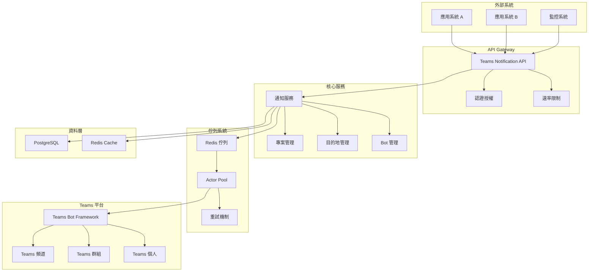

# 架構概覽

Teams Notification API 是一個基於 Go 的微服務架構，提供企業級的 Teams 通知服務。

## 整體架構



## 專案結構

```
repo-root/
├── cmd/                  # 各個可執行服務的入口
│   └── server/           # API 服務器
│       └── main.go
│
├── internal/             # 內部共用，不對外公開
│   ├── api/              # API 層
│   │   ├── handlers/     # HTTP 處理器
│   │   ├── middleware/   # 中間件
│   │   ├── repositories/ # 資料存取層
│   │   └── services/     # 業務邏輯層
│   ├── actor/            # Actor 模式實作
│   ├── database/         # 資料庫模型
│   └── queue/            # 佇列管理（舊版）
│
├── api/                  # API 定義
│   ├── proto/            # gRPC 定義
│   └── openapi/          # OpenAPI 規範
│
├── configs/              # 設定檔
│   ├── api-server.yaml
│   └── common.yaml
│
├── deployments/          # K8s 部署檔案
│   ├── api-server/
│   └── infra/
│
├── scripts/              # 工具腳本
│   ├── build.sh
│   ├── test.sh
│   └── migrations/
│
├── docs/                 # 文檔
│   ├── architecture/
│   ├── api/
│   └── user-guide/
│
├── go.mod
├── go.sum
└── Makefile
```

## 核心組件

### 1. API 服務器 (`cmd/server`)
- **框架**: Gin (HTTP 路由器)
- **功能**: 提供 RESTful API 端點
- **認證**: JWT + API Key 雙重認證
- **中間件**: 日誌、錯誤處理、速率限制

### 2. 業務邏輯層 (`internal/api/services`)
- **NotificationService**: 通知發送邏輯
- **ProjectService**: 專案管理
- **DestinationService**: 目的地管理
- **BroadcastService**: 廣播服務
- **ProvisionService**: 一鍵建立服務

### 3. 資料存取層 (`internal/api/repositories`)
- **Repository 模式**: 統一的資料存取介面
- **支援**: PostgreSQL + Redis
- **事務**: 支援資料庫事務

### 4. Actor 系統 (`internal/actor`)
- **NotificationActor**: 單一通知處理 Actor
 - **ActorPool**: Actor 池管理
- **Redis 整合**: 使用 Redis 管理佇列和狀態

### 5. 資料庫層 (`internal/database`)
- **模型定義**: Go struct 對應資料庫表
- **遷移**: SQL 遷移腳本
- **索引**: 優化查詢效能

## 技術棧

### 後端技術
- **語言**: Go 1.21+
- **框架**: Gin (HTTP), GORM (ORM)
- **資料庫**: PostgreSQL 14+
- **快取/佇列**: Redis 6+
- **認證**: JWT, Teams Bot Framework

### 部署技術
- **容器化**: Docker + Docker Compose
- **編排**: Kubernetes
- **監控**: 內建健康檢查端點
- **日誌**: 結構化日誌

### 外部整合
- **Teams**: Microsoft Teams Bot Framework
- **認證**: Azure Active Directory
- **API**: RESTful API 設計

## 設計原則

### 1. 微服務架構
- 單一職責原則
- 鬆耦合設計
- 獨立部署

### 2. 非同步處理
- Actor 模式處理通知
- Redis 佇列管理
- 智能重試機制

### 3. 可擴展性
- 水平擴展支援
- 無狀態設計
- 負載均衡友好

### 4. 可靠性
- 電路斷路器
- 重試機制
- 錯誤處理

### 5. 可觀測性
- 結構化日誌
- 健康檢查
- 指標監控

## 資料流

### 通知發送流程
1. **接收請求**: API 接收通知請求
2. **驗證授權**: 檢查 API Key 和權限
3. **建立通知**: 在資料庫中建立通知記錄
4. **建立目的地**: 為每個目標建立通知目的地記錄
5. **入隊處理**: 將通知目的地加入 Redis 佇列
6. **Actor 處理**: Actor 從佇列取出並發送
7. **狀態更新**: 更新發送狀態和結果

### 重試機制
1. **失敗檢測**: 檢測發送失敗
2. **重試策略**: 指數退避 + Teams Retry-After
3. **電路斷路器**: 防止持續失敗
4. **死信佇列**: 處理最終失敗

## 安全考量

### 認證授權
- JWT Token 認證
- API Key 管理
- 角色權限控制

### 資料保護
- 敏感資料加密
- 傳輸層安全 (HTTPS)
- 資料庫連線加密

### 速率限制
- 全域速率限制
- 每對話速率限制
- 自適應限制

## 監控和維護

### 健康檢查
- `/health` 端點
- 資料庫連線檢查
- Redis 連線檢查

### 日誌記錄
- 結構化 JSON 日誌
- 請求追蹤 ID
- 錯誤堆疊追蹤

### 效能監控
- 回應時間監控
- 吞吐量監控
- 錯誤率監控
