# Queue & Circuit Breaker Sequence Flow

## 🏗️ 系統架構特性

- ✅ **多節點部署**: API Server 可水平擴展，多個 Node 並行處理
- ✅ **Redis Queue**: 使用 Redis 實現分散式隊列
- ✅ **Redis Circuit Breaker**: 使用 Redis 共享熔斷器狀態
- ✅ **Dead Letter Queue**: 達到最大重試後以 `notification_destinations.status=failed` 表示
- ✅ **智能退避**: 優先使用 429 Retry-After，否則使用指數退避

## 📋 目錄

1. [通知發送完整流程](#1-通知發送完整流程)
2. [失敗通知入隊流程](#2-失敗通知入隊流程-redis-queue)
3. [Worker 重試流程](#3-worker-重試流程-多節點)
4. [Circuit Breaker 狀態管理](#4-circuit-breaker-狀態管理-redis)
5. [Dead Letter Queue 處理](#5-dead-letter-queue-處理)
6. [API 查詢流程](#6-api-查詢流程)

---

## 1. 通知發送完整流程

### 成功場景

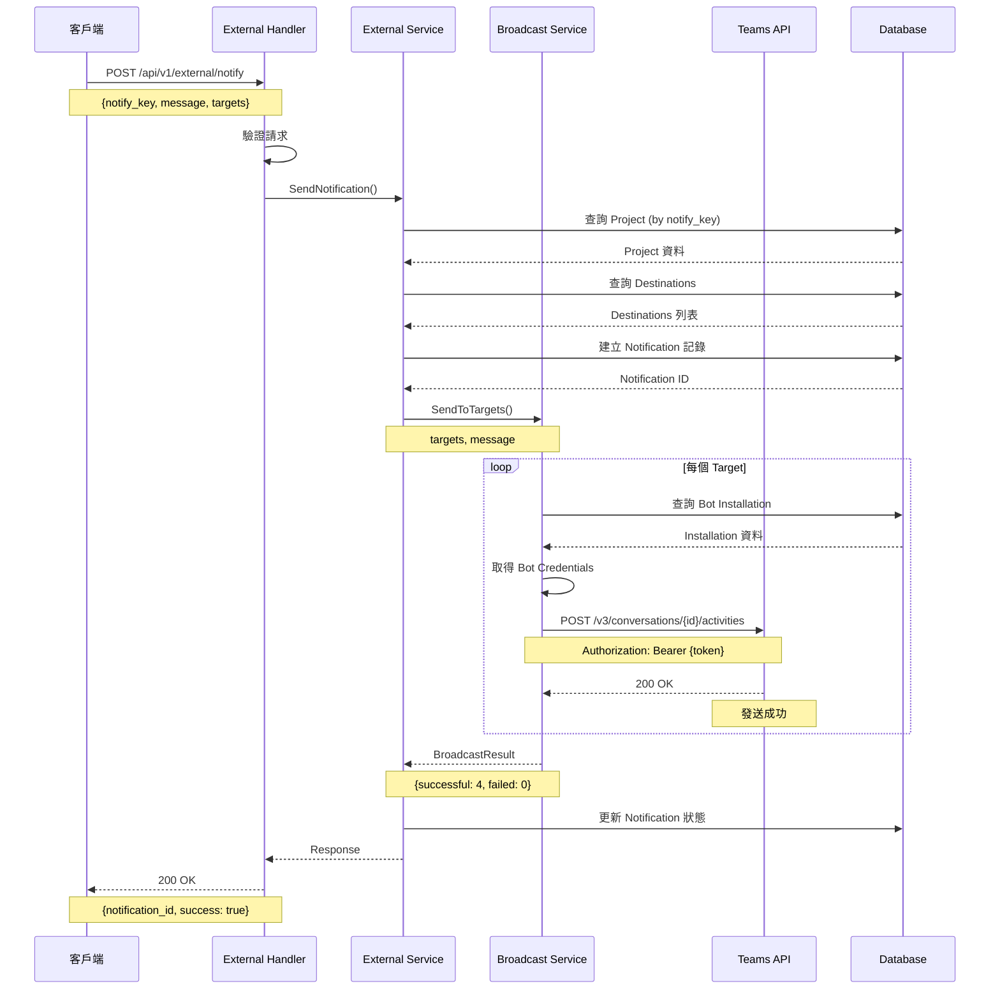

### 失敗場景（觸發 Queue）

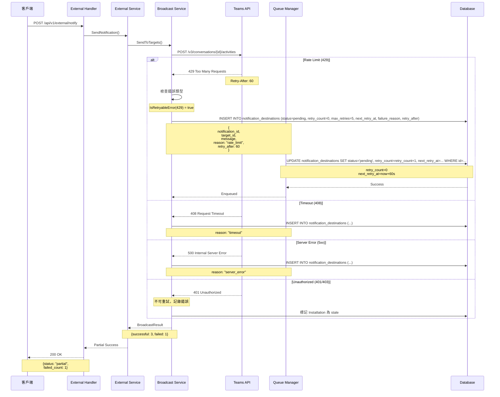

---

## 2. 失敗通知入隊流程 (Redis Queue)

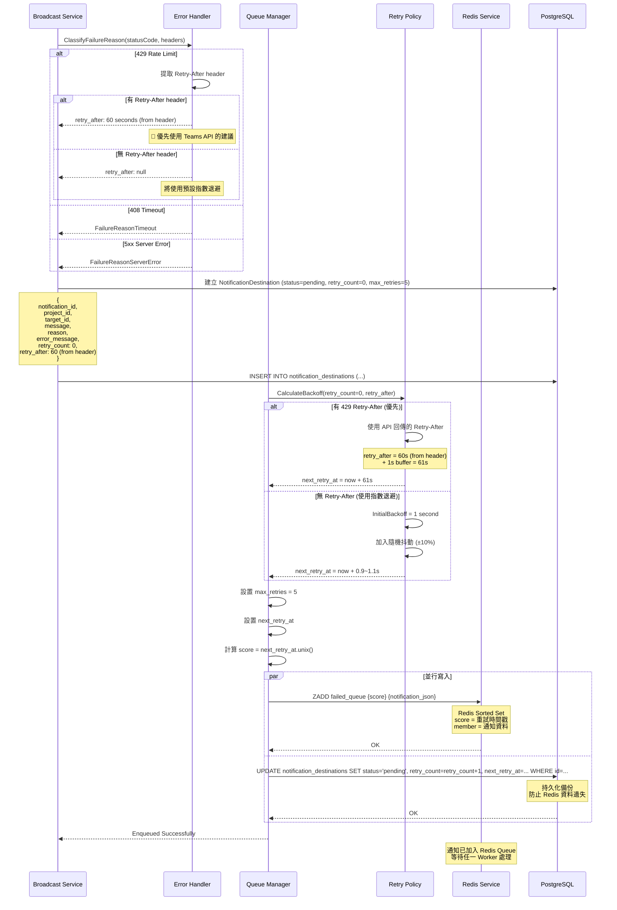

---

## 3. Worker 重試流程 (多節點)

### 多節點 Worker 並行處理

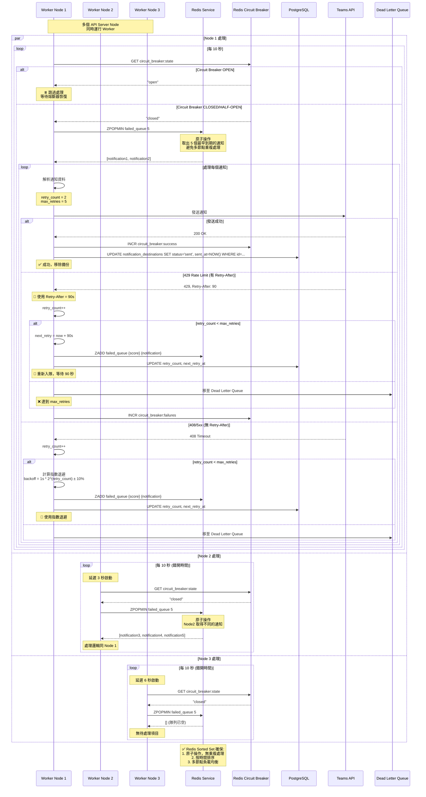

### 重試退避策略範例

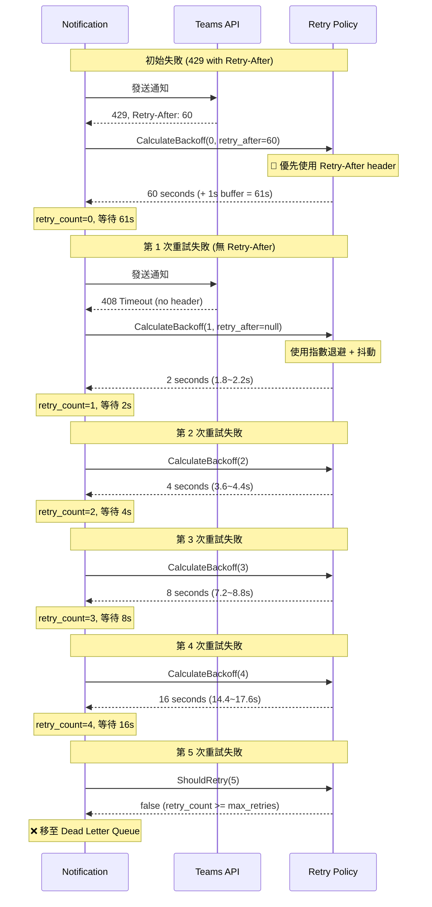

---

## 4. Circuit Breaker 狀態管理 (Redis)

### 使用 Redis 的分散式熔斷器

```mermaid
sequenceDiagram
    participant Node1 as Worker Node 1
    participant Node2 as Worker Node 2
    participant Redis as Redis Circuit Breaker
    participant Teams as Teams API

    Note over Redis: Redis Keys:<br/>cb:state = "closed"<br/>cb:failures = 0<br/>cb:last_failure = null<br/>cb:last_429_retry_after = null

    rect rgb(200, 255, 200)
        Note over Redis: 狀態: CLOSED (正常)
        
        par Node 1 發送
            Node1->>Redis: GET cb:state
            Redis-->>Node1: "closed"
            Node1->>Redis: GET cb:failures
            Redis-->>Node1: 0
            
            Node1->>Teams: 發送通知
            
            alt 成功
                Teams-->>Node1: 200 OK
                Node1->>Redis: SET cb:failures 0
                Node1->>Redis: INCR cb:success_count
                
            else 429 Rate Limit
                Teams-->>Node1: 429, Retry-After: 120
                Note over Node1: 🎯 記錄 Retry-After
                Node1->>Redis: INCR cb:failures
                Node1->>Redis: SET cb:last_429_retry_after 120
                Node1->>Redis: SET cb:last_failure {timestamp}
                Redis-->>Node1: failures = 1
                
            else 其他錯誤
                Teams-->>Node1: 408/5xx
                Node1->>Redis: INCR cb:failures
                Node1->>Redis: SET cb:last_failure {timestamp}
                Redis-->>Node1: failures = 1
            end
            
        and Node 2 發送 (並行)
            Node2->>Redis: GET cb:state
            Redis-->>Node2: "closed"
            
            Node2->>Teams: 發送通知
            Teams-->>Node2: 429
            
            Node2->>Redis: INCR cb:failures
            Redis-->>Node2: failures = 2
        end
        
        Note over Redis: ⚠️ 失敗計數累積中
        
        loop 持續失敗
            Node1->>Redis: INCR cb:failures
            Redis-->>Node1: failures = 5
            
            alt failures >= 5
                Node1->>Redis: Lua Script: 檢查並設置 OPEN
                Note over Redis: 原子操作:<br/>if failures >= 5 then<br/>  SET cb:state "open"<br/>  SET cb:open_until (now + retry_after or 60s)<br/>end
                
                Redis->>Redis: GET cb:last_429_retry_after
                Note over Redis: retry_after = 120s (from last 429)
                
                Redis->>Redis: SET cb:state "open"
                Redis->>Redis: SET cb:open_until {now + 120s}
                Note over Redis: 🔴 觸發熔斷！<br/>使用 Retry-After = 120s<br/>如無則使用 60s 預設值
                
                Redis-->>Node1: State changed to OPEN
            end
        end
    end

    rect rgb(255, 200, 200)
        Note over Redis: 狀態: OPEN (熔斷)
        
        par 多節點檢查
            Node1->>Redis: GET cb:state
            Redis-->>Node1: "open"
            Node1->>Redis: GET cb:open_until
            Redis-->>Node1: {timestamp}
            
            alt 未到 open_until 時間
                Node1->>Node1: 計算剩餘時間
                Note over Node1: ⏸️ 跳過處理<br/>還需等待 90 秒
                
            else 已過 open_until 時間
                Node1->>Redis: Lua Script: OPEN → HALF-OPEN
                Note over Redis: if now >= open_until then<br/>  SET cb:state "half-open"<br/>  SET cb:half_open_tests 0<br/>end
                
                Redis->>Redis: SET cb:state "half-open"
                Redis->>Redis: SET cb:half_open_tests 0
                Note over Redis: 🟡 進入測試狀態
                Redis-->>Node1: State changed to HALF-OPEN
            end
            
        and
            Node2->>Redis: GET cb:state
            Redis-->>Node2: "open"
            Note over Node2: ⏸️ 同樣跳過處理<br/>所有節點遵循相同狀態
        end
    end

    rect rgb(255, 255, 200)
        Note over Redis: 狀態: HALF-OPEN (測試)
        
        Note over Redis: 允許最多 3 個測試請求
        
        Node1->>Redis: Lua Script: 獲取測試配額
        Note over Redis: if state == "half-open" and<br/>   half_open_tests < 3 then<br/>  INCR cb:half_open_tests<br/>  return true<br/>end
        
        Redis->>Redis: INCR cb:half_open_tests
        Redis-->>Node1: Allowed (1/3)
        
        Node1->>Teams: 測試發送
        
        alt 測試成功
            Teams-->>Node1: 200 OK
            Node1->>Redis: INCR cb:half_open_success
            
            Node1->>Redis: GET cb:half_open_success
            Redis-->>Node1: 3
            
            alt 3 個測試都成功
                Node1->>Redis: Lua Script: HALF-OPEN → CLOSED
                Note over Redis: if half_open_success >= 3 then<br/>  SET cb:state "closed"<br/>  SET cb:failures 0<br/>  DEL cb:open_until<br/>end
                
                Redis->>Redis: SET cb:state "closed"
                Redis->>Redis: SET cb:failures 0
                Redis->>Redis: DEL cb:last_429_retry_after
                Note over Redis: 🟢 恢復正常
                Redis-->>Node1: State changed to CLOSED
            end
            
        else 測試失敗
            Teams-->>Node1: 429/Error
            Node1->>Redis: Lua Script: HALF-OPEN → OPEN
            
            Redis->>Redis: 檢查是否有新的 Retry-After
            alt 有 Retry-After
                Note over Redis: 使用新的 Retry-After = 180s
                Redis->>Redis: SET cb:state "open"
                Redis->>Redis: SET cb:open_until {now + 180s}
            else 無 Retry-After
                Redis->>Redis: SET cb:state "open"
                Redis->>Redis: SET cb:open_until {now + 120s (last retry_after)}
            end
            
            Note over Redis: 🔴 重新熔斷<br/>優先使用最新 Retry-After
            Redis-->>Node1: State changed to OPEN
        end
    end
```

### 狀態轉換圖

```
                     ┌─────────────────┐
                     │     CLOSED      │
                     │   (正常運行)     │
                     └────────┬────────┘
                              │
                     連續失敗 ≥ 5 次
                              │
                              ▼
                     ┌─────────────────┐
            ┌────────│      OPEN       │
            │        │   (熔斷拒絕)     │◄────┐
            │        └────────┬────────┘     │
            │                 │               │
            │        等待 1 分鐘後             │
            │                 │               │
            │                 ▼               │
            │        ┌─────────────────┐     │
            │        │   HALF-OPEN     │     │
            │        │  (測試恢復)      │     │
            │        └────────┬────────┘     │
            │                 │               │
            │        ┌────────┴────────┐     │
            │        │                 │     │
            │  3個測試請求成功   3個測試請求中  │
            │        │           任一失敗     │
            │        ▼                 │     │
            └────成功────────────────失敗───┘
```

---

## 5. Dead Letter Queue 處理

### 達到最大重試後的處理流程

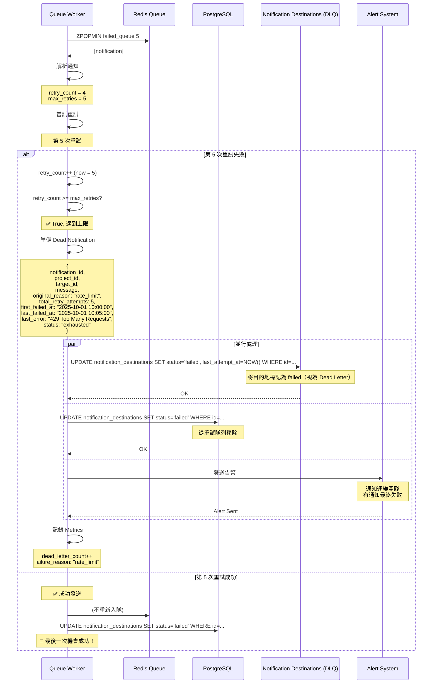

### Dead Notifications 表結構

```sql
CREATE TABLE dead_notifications (
    id UUID PRIMARY KEY DEFAULT gen_random_uuid(),
    notification_id UUID NOT NULL,
    project_id UUID NOT NULL,
    target_id TEXT NOT NULL,
    target_type TEXT NOT NULL,
    message JSONB NOT NULL,
    
    -- 失敗原因
    original_reason TEXT NOT NULL, -- rate_limit, timeout, server_error
    last_error TEXT,
    
    -- 重試歷史
    total_retry_attempts INT NOT NULL DEFAULT 5,
    first_failed_at TIMESTAMP NOT NULL,
    last_failed_at TIMESTAMP NOT NULL,
    
    -- 狀態
    status TEXT NOT NULL DEFAULT 'exhausted', -- exhausted, manual_retry, resolved
    
    -- 元數據
    metadata JSONB, -- 額外的診斷資訊
    
    -- 時間戳
    created_at TIMESTAMP DEFAULT NOW(),
    updated_at TIMESTAMP DEFAULT NOW(),
    resolved_at TIMESTAMP,
    
    -- 索引
    INDEX idx_dead_notifications_project (project_id),
    INDEX idx_dead_notifications_status (status),
    INDEX idx_dead_notifications_created (created_at DESC)
);
```

### Dead Letter Queue 查詢 API

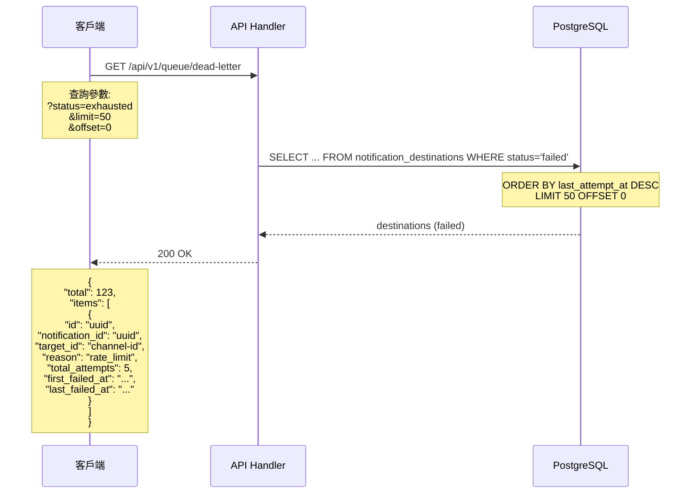

### 手動重試 Dead Letter

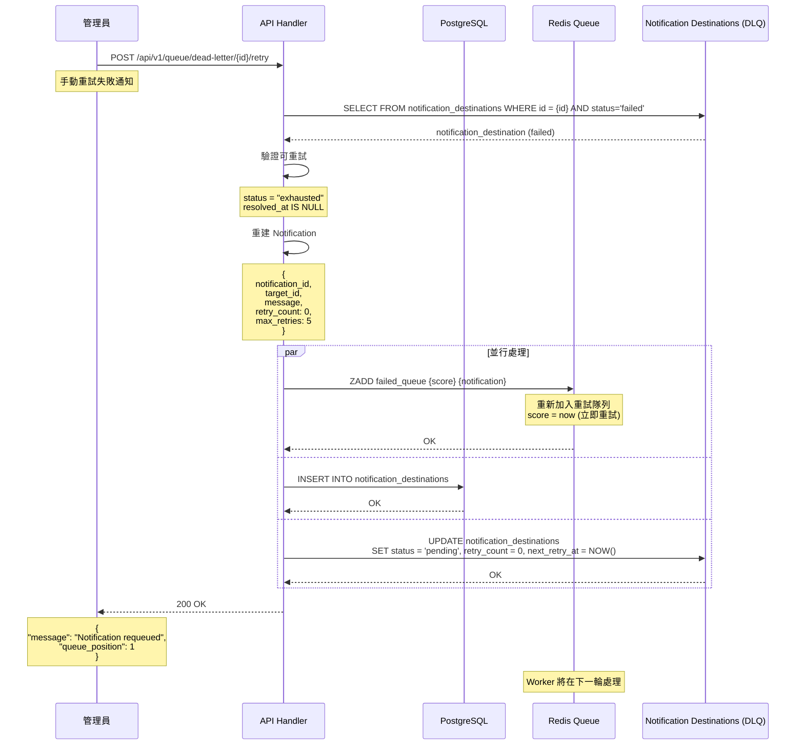

---

## 6. API 查詢流程

### 6.1 查詢隊列狀態

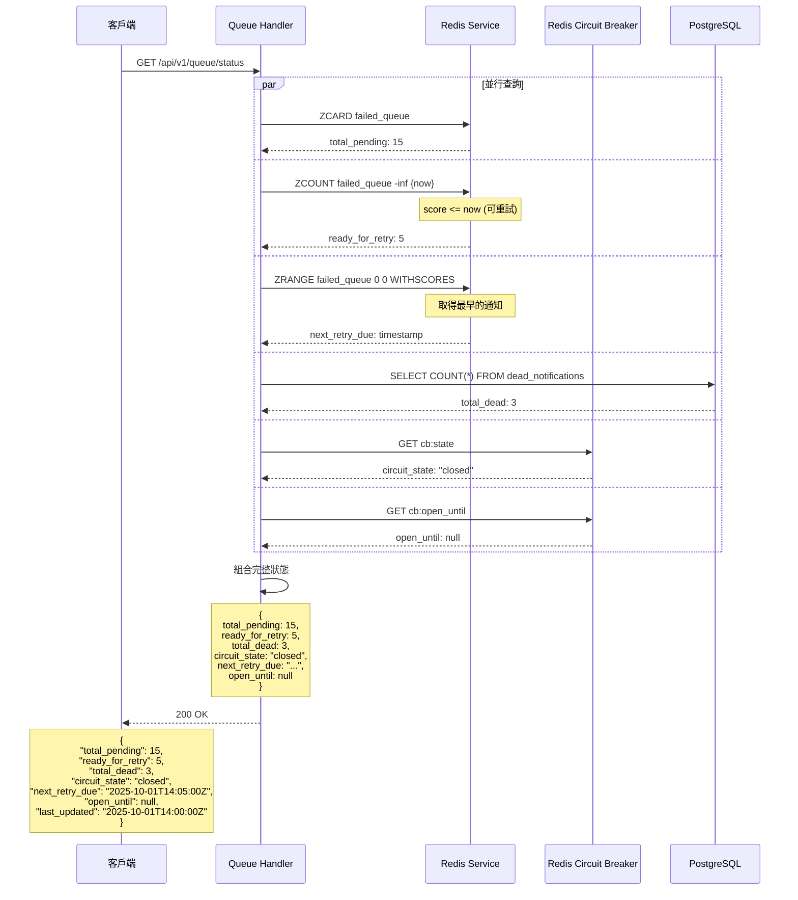

### 6.2 查詢熔斷器指標

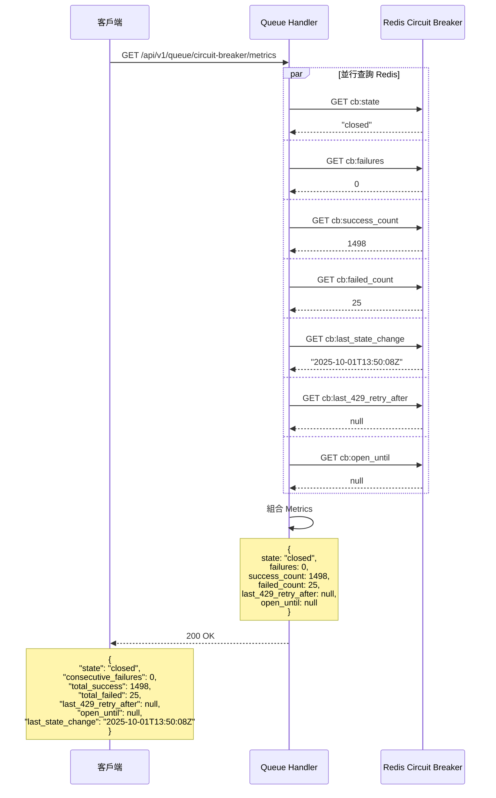

### 6.3 重置熔斷器

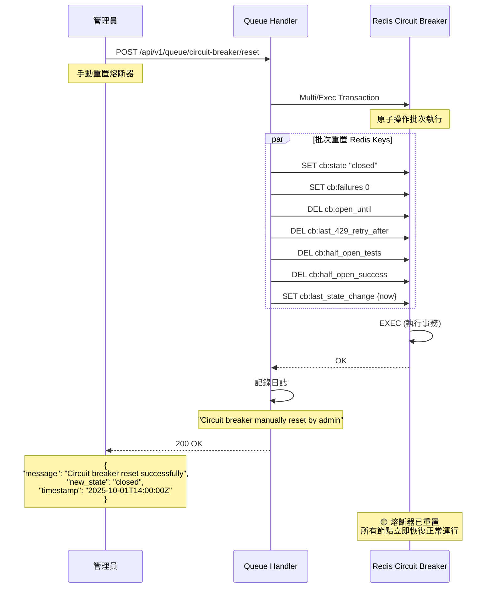

---

## 📊 時序圖總覽

### 完整系統互動 (多節點 + Redis)

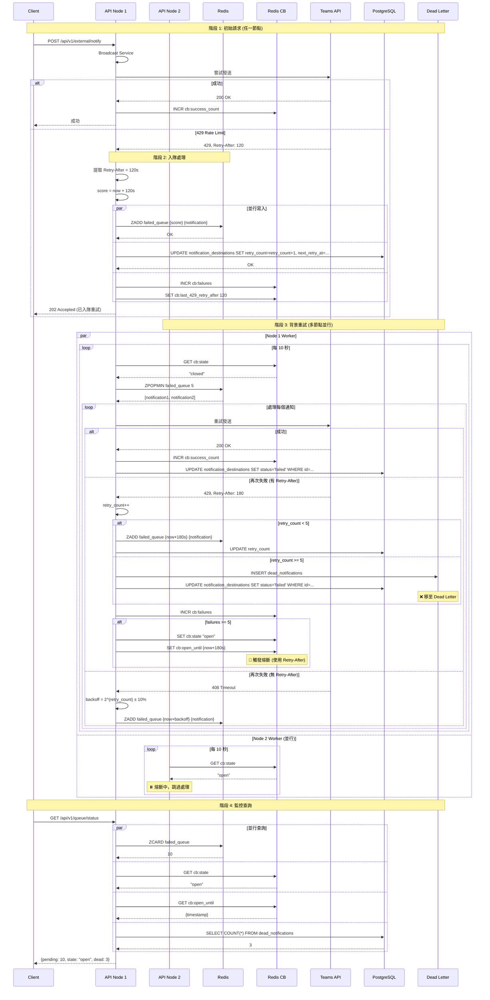

---

## 🔢 重要時間參數

| 參數 | 預設值 | 說明 | 備註 |
|------|--------|------|------|
| Worker 輪詢間隔 | 10 秒 | Worker 檢查隊列的頻率 | 可配置 |
| 批次處理大小 | 5 個/節點 | 每次處理的通知數量 | 避免雪崩 |
| 初始退避時間 | 1 秒 | 第一次重試的等待時間 | 無 Retry-After 時 |
| 最大退避時間 | 5 分鐘 | 重試等待的上限 | 指數退避上限 |
| 退避倍數 | 2.0 | 每次重試時間翻倍 | 1s → 2s → 4s → 8s → 16s |
| 隨機抖動 | ±10% | 避免雪崩效應 | 分散重試時間 |
| 最大重試次數 | 5 次 | 超過後移至 DLQ | 可配置 |
| 熔斷失敗閾值 | 5 次 | 連續失敗觸發熔斷 | 可配置 |
| 熔斷超時時間 | **優先使用 Retry-After** | Open 狀態持續時間 | **429 header 優先** |
| 預設熔斷時間 | 60 秒 | 無 Retry-After 時使用 | 後備機制 |
| 半開測試數量 | 3 個 | Half-Open 狀態的測試請求 | 成功後恢復 |
| Redis Key TTL | 7 天 | Redis 鍵過期時間 | 自動清理 |
| DLQ 保留時間 | 30 天 | Dead Letter 記錄保留期 | 可手動清理 |

---

## 📝 狀態說明

### 通知狀態
- **pending**: 等待重試（Redis score > now）
- **ready**: 可以重試（Redis score <= now）
- **retrying**: 正在重試中（已被 Worker ZPOPMIN）
- **exhausted**: 已耗盡重試次數（移至 dead_notifications）
- **success**: 重試成功（已從 Redis 和 DB 移除）

### 失敗原因
- **rate_limit**: 429 Too Many Requests（可能有 Retry-After header）
- **timeout**: 408 Request Timeout
- **server_error**: 5xx Server Error
- **network_error**: 網路連接問題
- **unauthorized**: 401/403 認證失敗（**不重試**）
- **bad_request**: 4xx Client Error（**不重試**）
- **unknown**: 其他未知錯誤

### Circuit Breaker 狀態 (Redis 共享)
- **closed**: 正常運行，所有節點允許請求
- **open**: 熔斷狀態，所有節點拒絕請求
- **half-open**: 測試狀態，允許有限數量的測試請求（3 個）

### Dead Letter 狀態
- **exhausted**: 達到最大重試次數
- **manual_retry**: 管理員手動重試
- **resolved**: 問題已解決（不再重試）

---

## 🎯 關鍵決策點

### 1. 是否入隊？
```go
func ShouldEnqueue(statusCode int, headers http.Header) bool {
    if statusCode == 429 || statusCode == 408 || (statusCode >= 500 && statusCode < 600) {
        // 可重試錯誤 → 入隊
        retryAfter := ExtractRetryAfter(headers) // 提取 Retry-After
        EnqueueToRedis(notification, retryAfter)
        return true
    }
    // 4xx (除 408) → 不重試，記錄錯誤
    LogError("Non-retryable error")
    return false
}
```

### 2. 計算重試時間？（優先使用 Retry-After）
```go
func CalculateNextRetry(retryCount int, retryAfter *int) time.Time {
    if retryAfter != nil {
        // 🎯 優先使用 429 的 Retry-After header
        return time.Now().Add(time.Duration(*retryAfter) * time.Second).Add(1 * time.Second) // +1s buffer
    }
    
    // 使用指數退避
    backoff := math.Pow(2, float64(retryCount)) * time.Second
    if backoff > 5*time.Minute {
        backoff = 5 * time.Minute // 最大 5 分鐘
    }
    
    // 加入隨機抖動 (±10%)
    jitter := backoff * 0.1 * (rand.Float64()*2 - 1)
    return time.Now().Add(backoff + jitter)
}
```

### 3. 何時移至 Dead Letter？
```go
func ProcessRetry(notification *Notification) {
    result := SendToTeams(notification)
    
    if result.Success {
        RemoveFromRedis(notification.ID)
        RemoveFromDB(notification.ID)
        return
    }
    
    notification.RetryCount++
    
    if notification.RetryCount >= MaxRetries { // 5
        // ❌ 達到最大重試次數
        MoveToDLQ(notification)
        RemoveFromRedis(notification.ID)
        RemoveFromDB(notification.ID)
        AlertAdmin(notification)
    } else {
        // 📅 重新入隊
        nextRetry := CalculateNextRetry(notification.RetryCount, result.RetryAfter)
        RequeueToRedis(notification, nextRetry)
        UpdateDB(notification)
    }
}
```

### 4. 何時觸發熔斷？（使用 Redis Retry-After）
```go
func OnFailure(err error, retryAfter *int) {
    redis.Incr("cb:failures")
    failures := redis.Get("cb:failures")
    
    if failures >= CircuitBreakerThreshold { // 5
        // 🔴 觸發熔斷
        openDuration := 60 * time.Second // 預設 60 秒
        
        if retryAfter != nil {
            // 🎯 優先使用最後一次 429 的 Retry-After
            redis.Set("cb:last_429_retry_after", *retryAfter)
            openDuration = time.Duration(*retryAfter) * time.Second
        } else if lastRetryAfter := redis.Get("cb:last_429_retry_after"); lastRetryAfter != nil {
            // 使用先前記錄的 Retry-After
            openDuration = time.Duration(*lastRetryAfter) * time.Second
        }
        
        redis.Set("cb:state", "open")
        redis.Set("cb:open_until", time.Now().Add(openDuration).Unix())
        
        LogInfo("Circuit breaker opened for %v (from Retry-After)", openDuration)
    }
}
```

### 5. Redis 資料結構
```redis
# Queue: Sorted Set (按時間排序)
ZADD failed_queue {next_retry_timestamp} {notification_json}
ZPOPMIN failed_queue 5  # 原子操作，多節點安全

# Circuit Breaker: String Keys
SET cb:state "closed|open|half-open"
SET cb:failures 0
SET cb:last_429_retry_after 120  # 最後一次 429 的 Retry-After
SET cb:open_until {unix_timestamp}
SET cb:half_open_tests 0
SET cb:success_count 1000
SET cb:failed_count 25
```

---

---

## 🏗️ 技術特性總結

### ✅ 已實現的關鍵特性

1. **多節點水平擴展**
   - 使用 Redis Sorted Set 實現分散式隊列
   - ZPOPMIN 原子操作避免重複處理
   - 每個節點獨立運行 Worker，負載自動平衡

2. **智能退避策略**
   - 🎯 **優先使用 429 Retry-After header**
   - 無 header 時使用指數退避 (1s, 2s, 4s, 8s, 16s)
   - 加入隨機抖動 (±10%) 避免雪崩

3. **Redis 共享熔斷器**
   - 所有節點共享熔斷器狀態
   - 觸發熔斷時優先使用 Retry-After 作為 open_until
   - 支援手動重置熔斷器

4. **Dead Letter Queue**
   - 達到 max_retries (5次) 自動移至 dead_notifications
   - 支援手動重試失敗通知
   - 保留完整的失敗歷史供分析

5. **雙重持久化**
   - Redis: 高效能隊列，按時間排序
   - PostgreSQL: 資料備份，防止 Redis 資料遺失

### 📊 系統容量

| 指標 | 值 | 說明 |
|------|-----|------|
| 節點數量 | 無限制 | 可水平擴展 |
| 每節點吞吐 | ~30 通知/分鐘 | 5 個/批次 × 6 次/分鐘 |
| 隊列容量 | > 100萬 | Redis Sorted Set |
| 重試延遲 | 0-300 秒 | 根據 Retry-After 動態調整 |
| 熔斷恢復 | 60-300 秒 | 根據 Retry-After 動態調整 |

---

**建立日期**: 2025-10-01  
**版本**: v2.0 (Redis + Multi-Node)  
**作者**: TeamsNotifyGoV2 Team  
**相關文檔**:
- [QUEUE_CIRCUIT_BREAKER.md](./QUEUE_CIRCUIT_BREAKER.md)
- [CHANGES_SUMMARY.md](../CHANGES_SUMMARY.md)
- [README.md](../README.md)

