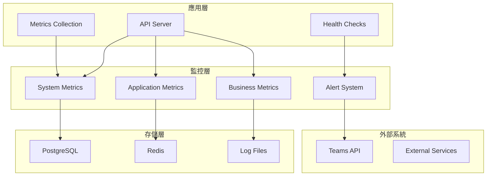

# 📊 Monitoring Guide

## 1. 文件資訊

- **版本**：v1.0
- **作者**：DevOps Engineer
- **最後更新**：2025-10-11
- **狀態**：✅ 完成

---

## 2. 監控架構概覽

TeamsNotifyGoV2 系統採用多層次監控架構，提供全面的系統可觀測性：



---

## 3. 監控端點

### 3.1 系統監控端點

| 端點 | 方法 | 用途 | 認證 | 響應時間 |
|------|------|------|------|----------|
| `/health` | GET | 基本健康檢查 | 無 | < 200ms |
| `/api/v1/metrics` | GET | 系統指標 | 無 | < 500ms |
| `/api/v1/config` | GET | 配置信息 | 無 | < 200ms |
| `/api/v1/config/validate` | POST | 配置驗證 | 無 | < 300ms |

### 3.2 監控系統端點

| 端點 | 方法 | 用途 | 認證 | 響應時間 |
|------|------|------|------|----------|
| `/api/v1/monitoring/health` | GET | 系統健康檢查 | 無 | < 200ms |
| `/api/v1/monitoring/performance` | GET | 性能指標 | 無 | < 500ms |
| `/api/v1/monitoring/business` | GET | 業務指標 | 無 | < 300ms |
| `/api/v1/monitoring/alerts` | GET | 警報狀態 | 無 | < 200ms |
| `/api/v1/monitoring/dashboard` | GET | 監控儀表板 | 無 | < 500ms |

### 3.3 佇列管理端點

| 端點 | 方法 | 用途 | 認證 | 響應時間 |
|------|------|------|------|----------|
| `/api/v1/queue/stats` | GET | 佇列統計 | 無 | < 200ms |

---

## 4. 指標分類

### 4.1 系統指標

#### 4.1.1 運行時指標

```json
{
  "system": {
    "uptime": "2h30m15s",
    "memory_usage_mb": 128,
    "cpu_usage_percent": 15.5,
    "goroutines": 45,
    "gc_runs": 12,
    "gc_pause_ms": 2.5
  }
}
```

#### 4.1.2 數據庫指標

```json
{
  "database": {
    "open_connections": 5,
    "idle_connections": 3,
    "max_connections": 25,
    "query_count": 1250,
    "query_time_avg_ms": 12.5,
    "slow_queries": 5,
    "connection_errors": 0,
    "last_query_time": "2025-10-11T10:45:00Z"
  }
}
```

#### 4.1.3 Redis 指標

```json
{
  "redis": {
    "connected": true,
    "memory_usage": "2.5MB",
    "key_count": 1250,
    "operations_per_second": 45.2,
    "hit_rate": 0.95,
    "miss_rate": 0.05,
    "evicted_keys": 0,
    "expired_keys": 12,
    "connected_clients": 1
  }
}
```

### 4.2 應用指標

#### 4.2.1 HTTP 指標

```json
{
  "http": {
    "requests_total": 1250,
    "requests_per_second": 15.2,
    "response_time_avg_ms": 45.5,
    "response_time_p95_ms": 120.0,
    "response_time_p99_ms": 250.0,
    "error_rate_percent": 2.5,
    "status_codes": {
      "200": 1200,
      "400": 25,
      "401": 15,
      "500": 10
    }
  }
}
```

#### 4.2.2 業務指標

```json
{
  "business": {
    "notifications_sent_total": 850,
    "notifications_sent_per_minute": 12.5,
    "notifications_failed_total": 25,
    "notifications_failed_rate_percent": 2.9,
    "queue_size": 15,
    "queue_processing_rate": 8.2,
    "teams_api_calls_total": 875,
    "teams_api_success_rate_percent": 97.1
  }
}
```

---

## 5. 告警機制

### 5.1 告警規則

#### 5.1.1 系統告警

| 指標 | 閾值 | 嚴重性 | 描述 |
|------|------|--------|------|
| CPU 使用率 | > 80% | Warning | 系統負載過高 |
| CPU 使用率 | > 90% | Critical | 系統負載極高 |
| 內存使用率 | > 85% | Warning | 內存使用率過高 |
| 內存使用率 | > 95% | Critical | 內存使用率極高 |
| 磁盤使用率 | > 80% | Warning | 磁盤空間不足 |
| 磁盤使用率 | > 90% | Critical | 磁盤空間嚴重不足 |

#### 5.1.2 應用告警

| 指標 | 閾值 | 嚴重性 | 描述 |
|------|------|--------|------|
| 錯誤率 | > 5% | Warning | 應用錯誤率過高 |
| 錯誤率 | > 10% | Critical | 應用錯誤率極高 |
| 響應時間 | > 2s | Warning | 響應時間過長 |
| 響應時間 | > 5s | Critical | 響應時間極長 |
| 佇列積壓 | > 100 | Warning | 佇列積壓過多 |
| 佇列積壓 | > 500 | Critical | 佇列積壓嚴重 |

#### 5.1.3 業務告警

| 指標 | 閾值 | 嚴重性 | 描述 |
|------|------|--------|------|
| 通知失敗率 | > 10% | Warning | 通知發送失敗率過高 |
| 通知失敗率 | > 20% | Critical | 通知發送失敗率極高 |
| Teams API 失敗率 | > 5% | Warning | Teams API 調用失敗 |
| Teams API 失敗率 | > 15% | Critical | Teams API 調用嚴重失敗 |

### 5.2 告警響應

#### 5.2.1 告警狀態

- **Active**: 活躍告警，需要處理
- **Resolved**: 已解決告警
- **Suppressed**: 被抑制的告警

#### 5.2.2 告警處理流程

1. **檢測**: 系統自動檢測到指標超過閾值
2. **觸發**: 生成告警事件
3. **通知**: 發送告警通知（可配置）
4. **處理**: 運維人員處理告警
5. **解決**: 問題解決後標記告警為已解決

---

## 6. 日誌管理

### 6.1 日誌結構

#### 6.1.1 日誌格式

```json
{
  "timestamp": "2025-10-11T10:45:00.123Z",
  "level": "INFO",
  "message": "Notification sent successfully",
  "service": "teams-notification-api",
  "trace_id": "abc123def456",
  "user_id": "user-123",
  "request_id": "req-456",
  "duration_ms": 125,
  "status_code": 200,
  "notification_id": "notif-789",
  "teams_channel": "general"
}
```

#### 6.1.2 日誌級別

| 級別 | 用途 | 示例 |
|------|------|------|
| DEBUG | 調試信息 | 詳細的執行流程 |
| INFO | 一般信息 | 業務操作記錄 |
| WARN | 警告信息 | 非致命錯誤 |
| ERROR | 錯誤信息 | 應用錯誤 |
| FATAL | 致命錯誤 | 系統崩潰 |

### 6.2 日誌分類

#### 6.2.1 訪問日誌

記錄所有 HTTP 請求：

```json
{
  "type": "access",
  "method": "POST",
  "path": "/api/v1/notifications",
  "status_code": 201,
  "response_time_ms": 125,
  "user_agent": "curl/7.68.0",
  "ip_address": "192.168.1.100"
}
```

#### 6.2.2 應用日誌

記錄業務邏輯：

```json
{
  "type": "application",
  "component": "notification_service",
  "action": "send_notification",
  "notification_id": "notif-123",
  "status": "success",
  "teams_channel": "general",
  "message_length": 150
}
```

#### 6.2.3 系統日誌

記錄系統事件：

```json
{
  "type": "system",
  "component": "database",
  "action": "connection_pool",
  "event": "connection_created",
  "pool_size": 10,
  "active_connections": 5
}
```

---

## 7. 監控工具

### 7.1 內建監控

#### 7.1.1 健康檢查

```bash
# 基本健康檢查
curl http://localhost:8080/health

# 詳細健康檢查
curl http://localhost:8080/health | jq '.'
```

#### 7.1.2 指標查詢

```bash
# 系統指標
curl http://localhost:8080/api/v1/metrics | jq '.'

# 監控系統健康檢查
curl http://localhost:8080/api/v1/monitoring/health | jq '.'

# 性能指標
curl http://localhost:8080/api/v1/monitoring/performance | jq '.'

# 業務指標
curl http://localhost:8080/api/v1/monitoring/business | jq '.'

# 警報狀態
curl http://localhost:8080/api/v1/monitoring/alerts | jq '.'

# 監控儀表板
curl http://localhost:8080/api/v1/monitoring/dashboard | jq '.'

# 佇列統計
curl http://localhost:8080/api/v1/queue/stats | jq '.'

# 配置信息
curl http://localhost:8080/api/v1/config | jq '.'
```

### 7.2 外部監控工具

#### 7.2.1 Prometheus 集成

```yaml
# prometheus.yml
scrape_configs:
  - job_name: 'teams-notification'
    static_configs:
      - targets: ['localhost:8080']
    metrics_path: '/api/v1/metrics'
    scrape_interval: 15s
```

#### 7.2.2 Grafana 儀表板

```json
{
  "dashboard": {
    "title": "Teams Notification API",
    "panels": [
      {
        "title": "Request Rate",
        "type": "graph",
        "targets": [
          {
            "expr": "rate(http_requests_total[5m])",
            "legendFormat": "{{method}} {{path}}"
          }
        ]
      }
    ]
  }
}
```

---

## 8. 故障排除

### 8.1 常見問題

#### 8.1.1 監控端點無響應

**症狀**: `/api/v1/metrics` 返回 404

**原因**: 路由未正確註冊

**解決方案**:
```bash
# 檢查路由註冊
curl -v http://localhost:8080/api/v1/metrics

# 檢查服務狀態
docker logs teamsnotify-api-server-local
```

#### 8.1.2 指標數據不準確

**症狀**: 指標數據異常或缺失

**原因**: 緩存問題或數據收集錯誤

**解決方案**:
```bash
# 清除緩存
curl -X POST http://localhost:8080/api/v1/config/validate

# 重新收集指標
curl http://localhost:8080/api/v1/metrics
```

### 8.2 性能優化

#### 8.2.1 指標收集優化

- 使用緩存減少重複計算
- 異步收集非關鍵指標
- 批量處理指標更新

#### 8.2.2 日誌優化

- 使用結構化日誌
- 控制日誌級別
- 定期清理舊日誌

---

## 9. 最佳實踐

### 9.1 監控設計

- **分層監控**: 系統、應用、業務三層監控
- **關鍵指標**: 專注於影響業務的關鍵指標
- **告警閾值**: 設定合理的告警閾值，避免告警疲勞

### 9.2 日誌管理

- **結構化**: 使用 JSON 格式便於解析
- **上下文**: 包含足夠的上下文信息
- **性能**: 避免日誌記錄影響應用性能

### 9.3 告警處理

- **分級處理**: 根據嚴重性分級處理
- **自動化**: 盡可能自動化告警處理
- **文檔化**: 記錄告警處理流程

---

**版本**: v1.0  
**最後更新**: 2025-10-11  
**作者**: TeamsNotify DevOps Team  
**狀態**: ✅ 完成
