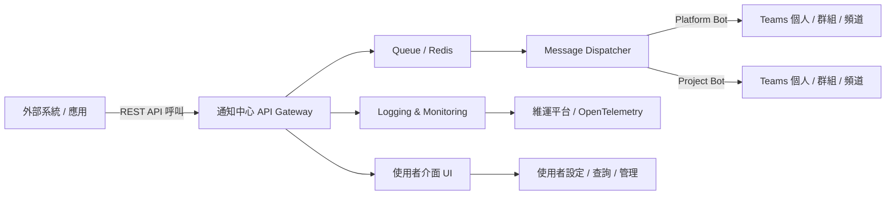

# 📘 Teams 通知中心系統使用手冊

## 1. 文件資訊
- **版本**：v1.0  
- **作者**：Teams Notification System Team  
- **最後更新**：2025-10-08  
- **適用對象**：一般使用者、系統整合者、維運人員

---

## 2. 系統簡介

Teams 通知中心系統是一個集中式的訊息通知平台，提供 REST API 與管理介面，能夠將外部系統的訊息轉發至 Microsoft Teams 的群組聊天、頻道或個人對話。

### 2.1 系統架構



### 2.2 核心功能

- **訊息轉發**：將外部系統訊息轉發至 Teams
- **多種傳送模式**：Platform Bot 和 Project Bot 模式
- **廣播功能**：支援大規模訊息廣播
- **存取控制**：基於權限的存取管理
- **監控稽核**：完整的日誌和監控功能

---

## 3. 使用角色與權限

| 角色 | 權限 | 說明 |
|------|------|------|
| **管理員** | 全權限 | 可設定租戶、Token、監控系統狀態 |
| **開發者** | API 操作 | 建立與查詢通知，使用 External API |
| **客服** | 查詢與回覆 | 查看狀態與歷史紀錄 |
| **系統整合者** | 專案管理 | 建立專案、配置目的地、使用 Provision API |

---

## 4. 快速開始

### 4.1 系統健康檢查

```bash
# 檢查服務狀態
curl -X GET http://localhost:8080/health | jq '.'
```

**預期回應**:
```json
{
  "status": "healthy",
  "timestamp": "2025-10-08T10:30:00Z",
  "version": "1.0.0"
}
```

### 4.2 基本通知發送

```bash
# 使用 External API 發送通知
curl -X POST http://localhost:8080/api/v1/notify \
  -H "Content-Type: application/json" \
  -d '{
    "notify_key": "your-project-notify-key",
    "message": "Hello Teams! 這是一個測試通知",
    "priority": "normal",
    "targets": ["all"]
  }'
```

---

## 5. 主要功能使用指南

### 5.1 External API - 外部系統整合

External API 是供外部系統使用的通知發送介面，透過 `notify_key` 來識別專案並發送通知。

#### 基本使用

```bash
# 發送基本通知
curl -X POST http://localhost:8080/api/v1/notify \
  -H "Content-Type: application/json" \
  -d '{
    "notify_key": "5984f00fe2c5007ea0edb4e9b6269a4abf304e71070ee05ef05575bfacda5e38",
    "message": "系統維護通知：將於今晚 10:00-11:00 進行系統維護",
    "priority": "high",
    "targets": ["all"],
    "mentions": ["@everyone"],
    "metadata": {
      "maintenance_id": "maint-001",
      "scheduled_time": "2025-10-08T22:00:00Z"
    }
  }'
```

#### 參數說明

| 參數 | 類型 | 必填 | 說明 |
|------|------|------|------|
| `notify_key` | string | ✅ | 專案的唯一識別碼 |
| `message` | string | ✅ | 通知內容 |
| `message_type` | string | ❌ | 訊息類型 (text/file/adaptive_card) |
| `priority` | string | ❌ | 優先級 (low/normal/high) |
| `targets` | array | ❌ | 目標篩選 (["all"] 或特定目標) |
| `mentions` | array | ❌ | 提及對象 |
| `metadata` | object | ❌ | 自定義元數據 |

### 5.2 Provision API - 專案管理

Provision API 提供一次性建立公司、專案和目的地的功能，簡化初始設定流程。

#### 建立新專案

```bash
curl -X POST http://localhost:8080/api/v1/provision \
  -H "Content-Type: application/json" \
  -d '{
    "company_id": "e4f160f4-4917-443d-86e9-29071967b768",
    "created_by": "11111111-1111-1111-1111-111111111111",
    "project_name": "測試專案",
    "project_description": "這是一個使用 provision API 建立的測試專案",
    "teams_tenant_id": "051cece0-e4dc-4aed-b471-bf29824e1ee6",
    "targets": [
      {
        "type": "channel",
        "tenant_id": "051cece0-e4dc-4aed-b471-bf29824e1ee6",
        "conversation_id": "19:lg5lz80dPDcE8OtOolOHKsNZYIZI0IslJnnGDBV2H5A1@thread.tacv2"
      }
    ]
  }'
```

#### 專案管理操作

```bash
# 取得專案資訊
curl -X GET http://localhost:8080/api/v1/provision/{notify_key}

# 啟用專案
curl -X POST http://localhost:8080/api/v1/provision/{notify_key}/enable

# 停用專案
curl -X POST http://localhost:8080/api/v1/provision/{notify_key}/disable
```

### 5.3 系統監控

#### 5.3.1 基本健康檢查

```bash
# 系統健康檢查
curl -X GET http://localhost:8080/health | jq '.'

# 詳細健康檢查
curl -X GET http://localhost:8080/api/v1/monitoring/health | jq '.'
```

#### 5.3.2 監控指標查詢

```bash
# 系統指標
curl -X GET http://localhost:8080/api/v1/metrics | jq '.'

# 性能指標
curl -X GET http://localhost:8080/api/v1/monitoring/performance | jq '.'

# 業務指標
curl -X GET http://localhost:8080/api/v1/monitoring/business | jq '.'

# 警報狀態
curl -X GET http://localhost:8080/api/v1/monitoring/alerts | jq '.'

# 監控儀表板
curl -X GET http://localhost:8080/api/v1/monitoring/dashboard | jq '.'
```

#### 5.3.3 Queue Management API - 佇列監控

Queue Management API 用於監控和管理通知佇列狀態、電路斷路器狀態。

```bash
# 查詢隊列狀態
curl -X GET http://localhost:8080/api/v1/queue/stats | jq '.'
```

#### 5.3.4 監控指標說明

**系統健康檢查回應範例**:
```json
{
  "data": {
    "status": "healthy",
    "timestamp": "2025-10-12T08:55:11.062154085+08:00",
    "components": {
      "api": {
        "status": "healthy",
        "message": "API service running"
      },
      "database": {
        "status": "healthy", 
        "message": "Database connection successful"
      },
      "redis": {
        "status": "healthy",
        "message": "Redis connection successful"
      }
    },
    "overall": {
      "score": 100,
      "grade": "A",
      "message": "System is healthy"
    }
  }
}
```

**業務指標回應範例**:
```json
{
  "business": {
    "notifications_sent": 5,
    "notifications_failed": 1,
    "notifications_pending": 35,
    "success_rate": 83.33,
    "average_response_time_ms": 0,
    "teams_api_calls": 6,
    "teams_api_errors": 1,
    "queue_processing_rate_per_minute": 0,
    "active_projects": 3,
    "active_destinations": 5
  }
}
```

---

## 6. 使用場景範例

### 6.1 系統監控警報

```bash
# 發送 CPU 使用率警報
curl -X POST http://localhost:8080/api/v1/notify \
  -H "Content-Type: application/json" \
  -d '{
    "notify_key": "monitoring-alerts",
    "message": "🚨 CPU 使用率過高：95%",
    "priority": "high",
    "metadata": {
      "alert_type": "cpu_usage",
      "threshold": 90,
      "current_value": 95,
      "server": "web-server-01"
    }
  }'
```

### 6.2 部署通知

```bash
# 發送部署完成通知
curl -X POST http://localhost:8080/api/v1/notify \
  -H "Content-Type: application/json" \
  -d '{
    "notify_key": "deployment-notifications",
    "message": "✅ 部署完成：v2.1.0 已成功部署到生產環境",
    "priority": "normal",
    "metadata": {
      "version": "v2.1.0",
      "environment": "production",
      "deployment_time": "2025-10-08T14:30:00Z"
    }
  }'
```

### 6.3 業務通知

```bash
# 發送訂單通知
curl -X POST http://localhost:8080/api/v1/notify \
  -H "Content-Type: application/json" \
  -d '{
    "notify_key": "order-notifications",
    "message": "🛒 新訂單：訂單 #12345 已建立，金額：$299.99",
    "priority": "normal",
    "mentions": ["@sales-team"],
    "metadata": {
      "order_id": "12345",
      "amount": 299.99,
      "customer": "John Doe"
    }
  }'
```

---

## 7. 錯誤處理與狀態碼

### 7.1 錯誤分類

| 錯誤類型 | 錯誤代碼 | HTTP 狀態碼 | 描述 |
|----------|----------|-------------|------|
| **認證錯誤** | UNAUTHORIZED | 401 | 未授權訪問 |
| | INVALID_TOKEN | 401 | 無效或格式錯誤的 Token |
| | TOKEN_EXPIRED | 401 | Token 已過期 |
| | INVALID_API_KEY | 401 | 無效的 API 金鑰 |
| **Teams API 錯誤** | TEAMS_AUTH_FAILED | 500 | Teams 認證失敗 |
| | TEAMS_API_ERROR | 500 | Teams API 調用錯誤 |
| | TEAMS_RATE_LIMIT | 429 | Teams API 速率限制 |
| **數據庫錯誤** | DATABASE_ERROR | 500 | 數據庫操作失敗 |
| | RECORD_NOT_FOUND | 404 | 記錄不存在 |
| | DUPLICATE_RECORD | 409 | 重複記錄 |
| **驗證錯誤** | VALIDATION_FAILED | 400 | 輸入驗證失敗 |
| | INVALID_INPUT | 400 | 無效輸入 |
| | MISSING_FIELD | 400 | 缺少必要欄位 |
| **系統錯誤** | INTERNAL_ERROR | 500 | 內部服務錯誤 |
| | SERVICE_UNAVAILABLE | 503 | 服務不可用 |
| | TIMEOUT | 408 | 請求超時 |

### 7.2 錯誤響應格式

#### 標準錯誤響應
```json
{
  "error": {
    "code": "VALIDATION_FAILED",
    "message": "Input validation failed",
    "details": "Field 'email' is required",
    "cause": "Missing required field"
  },
  "timestamp": "2025-10-08T01:47:31Z",
  "request_id": "req_123456789"
}
```

#### 簡化錯誤響應
```json
{
  "success": false,
  "error": "Invalid request format",
  "code": "VALIDATION_FAILED",
  "details": "Field 'email' is required",
  "timestamp": "2025-10-08T01:47:31Z",
  "request_id": "req_123456789"
}
```

### 7.3 常見錯誤處理

#### 認證錯誤處理
```bash
# 檢查環境變數
echo $TEAMS_BOT_APP_ID
echo $TEAMS_TENANT_ID
echo $TEAMS_BOT_APP_PASSWORD

# 重新設定環境變數
export TEAMS_BOT_APP_ID=844146d7-4ac9-4e4d-a463-d6e027714e81
export TEAMS_TENANT_ID=051cece0-e4dc-4aed-b471-bf29824e1ee6
export TEAMS_BOT_APP_PASSWORD='your-password'
```

#### 驗證錯誤處理
```bash
# 檢查請求格式
curl -X POST http://localhost:8080/api/v1/notify \
  -H "Content-Type: application/json" \
  -d '{
    "notify_key": "valid-key",
    "message": "Test message"
  }' | jq '.'
```

## 8. 常見問題與解決方案

### 8.1 服務無法啟動

**問題**：服務啟動時出現錯誤或無法訪問

**解決方案**：
```bash
# 檢查端口是否被佔用
lsof -i :8080

# 停止佔用端口的程序
pkill -f "./server"

# 檢查環境變數
echo $TEAMS_BOT_APP_ID
echo $TEAMS_TENANT_ID
echo $TEAMS_BOT_APP_PASSWORD

# 重新啟動服務
bash start_server.sh
```

### 8.2 資料庫連線失敗

**問題**：出現資料庫連線錯誤

**解決方案**：
```bash
# 檢查 Docker 容器狀態
docker ps | grep postgres

# 啟動 PostgreSQL 容器
docker-compose up -d postgres

# 測試資料庫連線
docker exec teamsnotify-postgres psql -U teamsnotify -d notification_center -c "SELECT 1;"
```

### 8.3 Teams 認證失敗

**問題**：發送通知時出現認證錯誤

**解決方案**：
```bash
# 檢查環境變數
export TEAMS_BOT_APP_ID=844146d7-4ac9-4e4d-a463-d6e027714e81
export TEAMS_TENANT_ID=051cece0-e4dc-4aed-b471-bf29824e1ee6
export TEAMS_BOT_APP_PASSWORD='your-password'

# 重新啟動服務
bash start_server.sh

# 檢查 Bot 註冊狀態
curl http://localhost:8080/api/v1/bots/platform
```

### 8.4 通知發送失敗

**問題**：通知無法成功發送到 Teams

**解決方案**：
```bash
# 檢查 Bot 安裝狀態
docker exec teamsnotify-postgres psql -U teamsnotify -d notification_center -c "
SELECT conversation_id, installation_status 
FROM bot_installations 
WHERE installation_status = 'active';"

# 更新 Bot 安裝狀態
docker exec teamsnotify-postgres psql -U teamsnotify -d notification_center -c "
UPDATE bot_installations 
SET installation_status = 'active' 
WHERE installation_status = 'stale';"
```

---

## 8. 監控與維護

### 8.1 健康檢查

```bash
# 自動健康檢查腳本
#!/bin/bash
while true; do
    if ! curl -f http://localhost:8080/health > /dev/null 2>&1; then
        echo "Service is down at $(date)"
        # 發送警報
    fi
    sleep 30
done
```

### 8.2 效能監控

```bash
# 監控 API 回應時間
curl -w "@curl-format.txt" -o /dev/null -s http://localhost:8080/health

# 監控隊列狀態
watch -n 2 'curl -s http://localhost:8080/api/v1/queue/status | jq "{pending: .total_pending, retrying: .total_retrying, failed: .total_failed, circuit: .circuit_state}"'
```

### 8.3 日誌查看

```bash
# 查看服務日誌
tail -f server.log

# 查看 Docker 容器日誌
docker logs teamsnotify-postgres
docker logs teamsnotify-redis

# 查看特定時間的日誌
grep "2025-10-08" server.log
```

---

## 9. 最佳實踐

### 9.1 錯誤處理

```bash
#!/bin/bash
# 發送通知並處理錯誤

send_notification() {
  local notify_key="$1"
  local message="$2"
  
  response=$(curl -s -X POST http://localhost:8080/api/v1/notify \
    -H "Content-Type: application/json" \
    -d "{
      \"notify_key\": \"$notify_key\",
      \"message\": \"$message\"
    }")
  
  success=$(echo "$response" | jq -r '.success')
  
  if [ "$success" = "true" ]; then
    echo "✅ 通知發送成功"
    echo "$response" | jq '.data.notification_id'
  else
    echo "❌ 通知發送失敗"
    echo "$response" | jq -r '.error'
    exit 1
  fi
}

# 使用範例
send_notification "my-project" "測試訊息"
```

### 9.2 批次發送

```bash
#!/bin/bash
# 批次發送多個通知

messages=(
  "系統狀態正常"
  "資料庫連線穩定"
  "API 回應時間正常"
)

for message in "${messages[@]}"; do
  curl -X POST http://localhost:8080/api/v1/notify \
    -H "Content-Type: application/json" \
    -d "{
      \"notify_key\": \"system-status\",
      \"message\": \"$message\",
      \"priority\": \"normal\"
    }" > /dev/null
  
  echo "已發送：$message"
  sleep 1  # 避免請求過於頻繁
done
```

### 9.3 監控和重試

```bash
#!/bin/bash
# 發送通知並監控狀態

notify_key="monitoring-alerts"
message="系統警報測試"

# 發送通知
response=$(curl -s -X POST http://localhost:8080/api/v1/notify \
  -H "Content-Type: application/json" \
  -d "{
    \"notify_key\": \"$notify_key\",
    \"message\": \"$message\",
    \"priority\": \"high\"
  }")

notification_id=$(echo "$response" | jq -r '.data.notification_id')

if [ "$notification_id" != "null" ]; then
  echo "通知已發送，ID: $notification_id"
  
  # 等待處理完成
  sleep 5
  
  # 檢查狀態
  echo "檢查通知狀態..."
else
  echo "發送失敗：$(echo "$response" | jq -r '.error')"
fi
```

---

## 10. 限制和配額

### 10.1 專案限制

每個專案都有以下限制：
- **每日限制**：預設 10,000 則通知
- **每月限制**：預設 300,000 則通知
- **速率限制**：100 請求/秒

### 10.2 訊息限制

- **訊息長度**：最大 8,000 字符
- **提及數量**：最多 50 個提及
- **元數據大小**：最大 1KB

---

## 11. 技術支援

### 11.1 聯絡方式

- **Teams 頻道**：#support-notify  
- **Email**：support@company.com
- **文檔**：[完整 API 文檔](../03_DESIGN/SystemDesign.md)

### 11.2 診斷資訊收集

```bash
#!/bin/bash
# 收集診斷資訊

echo "=== System Info ===" > diagnostic.log
uname -a >> diagnostic.log
docker version >> diagnostic.log
go version >> diagnostic.log

echo "=== Service Status ===" >> diagnostic.log
ps aux | grep server >> diagnostic.log
curl http://localhost:8080/health >> diagnostic.log

echo "=== Database Status ===" >> diagnostic.log
docker exec teamsnotify-postgres psql -U teamsnotify -d notification_center -c "SELECT COUNT(*) FROM notifications;" >> diagnostic.log

echo "=== Recent Logs ===" >> diagnostic.log
tail -100 server.log >> diagnostic.log
```

---

## 12. 更新日誌

### v1.0.0 (2025-10-08)
- 實現統一的錯誤處理機制
- 添加標準化錯誤響應格式
- 建立錯誤分類和狀態碼映射
- 實現錯誤監控和告警
- 新增 Queue & Circuit Breaker 功能
- 支援 External API 和 Provision API

---

**建立日期**: 2025-10-08  
**版本**: v1.0.0  
**狀態**: ✅ 開發完成，測試通過
